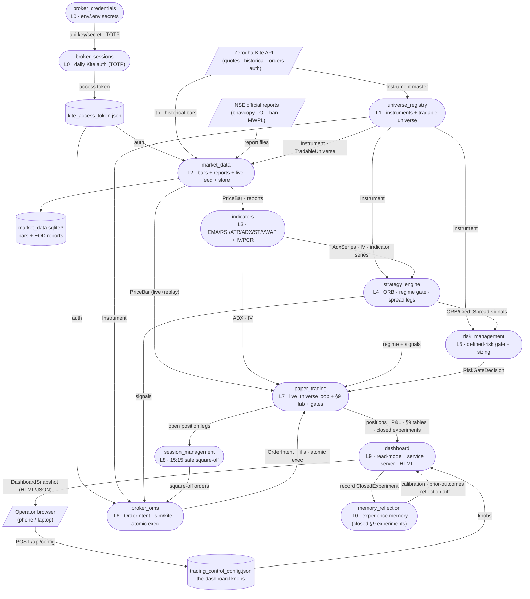
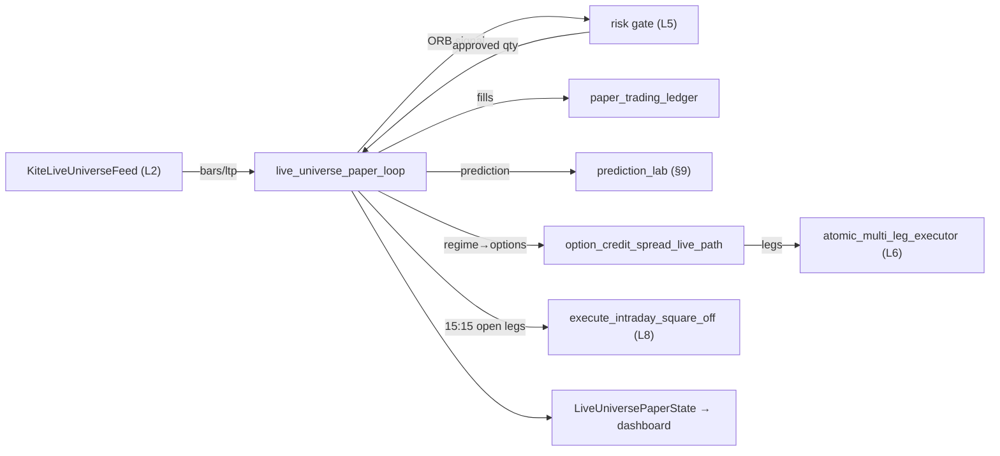
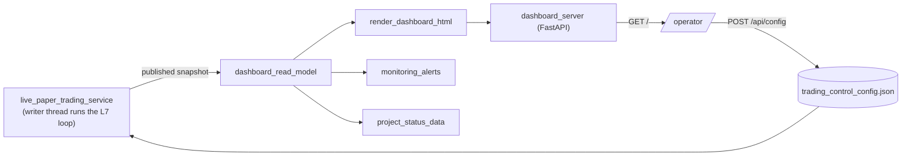

# SYSTEM MAP — the living architecture & data-flow map

**This is the single source of truth for how this project is built and how
data flows through it.** Read THIS first — before opening any source file.
A fresh agent (on any server) should be able to understand the whole system
from this one document, and any human/agent should be able to find "which
files make up feature X, what flows into it, what it emits, and how data
moves file-to-file inside it" without grepping the tree.

- **Format:** a Data-Flow Diagram (features = processes) fused with the C4
  model's Component→Code levels. Rendered in **Mermaid** (text = git-diffable,
  agent-parseable, renders in any Markdown/Artifact viewer).
- **Generated from the real code** (AST import graph), not memory — so it is
  true to what is actually on the server. Last regenerated: **2026-07-25ac**.
- **143 Python modules across 14 features** (packages under
  `src/nse_algo_trader/`).

---

## §0 · HOW TO READ AND MAINTAIN THIS MAP  (read before editing)

### How to read
- A **feature** = one package under `src/nse_algo_trader/` (≈ one layer).
  It is a box/subgraph. Inside it are its **files** (the "code" level).
- An **edge A → B labelled `X`** means *data `X` flows from A into B* (in
  code: B imports/calls A and consumes its output). Direction = data flow,
  NOT import direction (import is the reverse arrow).
- **Shapes:** `([rounded])` = a feature/process · `[(cylinder)]` = a data
  store (file/DB on disk) · `[/parallelogram/]` = an external entity
  (Kite API, NSE website, the browser operator).
- **Layer number** in each feature = its position in the build pipeline
  (see `docs/flowcharts/00_project_overview.md` for the roadmap).

### How to MAINTAIN (do this on EVERY new file or feature — Rule H)
When you add/rename/delete a file or feature, or change what flows between
them, you MUST update this map in the same change:
1. **Regenerate the ground truth** — run the extractor (below) to get the
   current file list, roles, and the real import/data-flow edges. Never
   hand-guess the graph; derive it from the code.
2. **Update §1** (system diagram) if a feature-to-feature edge appeared or
   vanished. Update §2 (the feature's registry block: files table + inputs/
   outputs + internal-flow diagram). Update §3 if a runtime loop changed.
3. **Append to §4** (maintenance ledger): date, what changed, why.
4. Keep every file's one-line role in sync with its module docstring (Rule C
   names + docstrings are the source of the role text).

### The extractor (run to regenerate ground truth)
```bash
python3 - <<'PY'
import ast; from pathlib import Path; from collections import defaultdict
SRC=Path("src/nse_algo_trader")
def feat(p): r=p.relative_to(SRC).parts; return r[0] if len(r)>1 else "(top)"
def doc(t): d=ast.get_docstring(t); return (d.splitlines()[0].strip() if d else "")
edges=defaultdict(set); files=defaultdict(list)
for m in sorted(SRC.rglob("*.py")):
    f=feat(m); files[f].append(m.stem)
    if m.name=="__init__.py": continue
    for n in ast.walk(ast.parse(m.read_text())):
        if isinstance(n,ast.ImportFrom) and n.module and n.module.startswith("nse_algo_trader"):
            tf=n.module.split(".")[1]
            if tf!=f: edges[f].add(tf)   # f imports tf  => data tf -> f
for f in sorted(edges): print(f, "<-", sorted(edges[f]))
PY
```
Edge reading: `A <- [B, C]` printed by the extractor means **A imports B and
C**, i.e. **data flows B→A and C→A**. §1 draws it in data-flow direction.

---

## §1 · SYSTEM DATA-FLOW (all features + external entities + stores)

Verified feature edges (2026-07-24): market_data←universe · indicators←market_data
· strategy_engine←{indicators,market_data,universe} · risk_management←{strategy,universe}
· broker_oms←{strategy,universe} · paper_trading←{broker_oms,indicators,market_data,
risk_management,session_management,strategy_engine,universe} · session_management←
{broker_oms,paper_trading,universe} · dashboard←(everything) · broker_sessions←
broker_credentials.



**The spine (build/data order):** `Kite/NSE → universe_registry → market_data
→ indicators → strategy_engine → risk_management → broker_oms →
paper_trading → session_management → dashboard → operator`. `broker_credentials
→ broker_sessions` is the side auth chain feeding Kite access to market_data,
broker_oms, and the dashboard. **`paper_trading` is the integration hub** (it
imports 7 features); **`dashboard` is the top observer** (it reads all).

---

## §2 · FEATURE REGISTRY (files · inputs · outputs · internal flow)

Each block: purpose · files (role) · what flows IN/OUT · internal file→file flow.

### L0 · broker_credentials  (2 files)  — secrets in, never committed
- `broker_api_credentials_loader.py` — loads API key/secret from env/.env; `load_broker_api_credentials`, `load_env_file_into_environ`.
- `kite_login_credentials_loader.py` — loads Kite user/password/TOTP secret; `load_kite_login_credentials`.
- IN: `.env` (gitignored). OUT: credentials → broker_sessions.
- Internal: `kite_login_credentials_loader → broker_api_credentials_loader`.

### L0 · broker_sessions  (8 files)  — daily broker auth (Kite / Breeze / Angel One)
- `kite_access_token_store.py` — persists the daily token + expiry; `KiteAccessTokenFileStore`.
- `kite_totp_auto_login.py` — user+password+TOTP → request token → access token; `generate_and_store_daily_kite_access_token`.
- `refresh_kite_access_token.py` — CLI (cron pre-market) that refreshes if stale; `refresh_kite_access_token_if_needed`.
- **Breeze (§53 slice 4 #6a):** `breeze_session_token_store.py` (`BreezeSessionTokenFileStore`/`Record` — daily manual token + midnight/24h expiry) · `breeze_authenticated_client_builder.py` (`build_authenticated_breeze_client` — constructs + `generate_session`; injectable factory keeps the network-heavy `breeze_connect` import out of tests) · `set_breeze_session_token.py` (CLI to store the pasted apisession / print the login URL).
- **Angel One (task #18):** `angel_one_smartapi_session.py` — `build_angel_one_authenticated_historical_client(api_key, client_code, pin, totp_secret)` does the SmartAPI `generateSession` (loginByPassword, TOTP via pyotp) → jwtToken, returning `AngelOneAuthenticatedHistoricalClient` exposing `getCandleData(param)` (the shape the Angel adapter injects). No SDK; requests + pyotp. Session resets midnight IST → run daily.
- IN: credentials (L0). OUT: `kite_access_token.json` + `breeze_session_token.json` consumed by market_data/broker_oms/dashboard; the Angel client is built + injected into `AngelOneHistoricalBarSource` at the composition root (verify script today).
- Internal: `refresh → {totp_auto_login → access_token_store}`.

### L1 · universe_registry  (4 files)  — what is tradable
- `instrument_types.py` — `Instrument`, `ExchangeSegment`, `InstrumentKind`, `OptionRight` (the core type everything shares).
- `kite_instrument_master_loader.py` — classify Kite master rows → phase-1 universe; `build_phase1_instrument_universe`.
- `nse_index_options_reference.py` — the 5 NSE index-option underlyings.
- `live_tradable_universe.py` — mainboard cash + near-expiry ATM/ITM/OTM option ladders + index-spot resolver; `fetch_live_tradable_universe`, `TradableUniverse`, `resolve_spot_instrument_by_option_underlying`.
- IN: Kite instrument master + live spots. OUT: `Instrument` / `TradableUniverse` → market_data, strategy, risk, oms, paper_trading.

### L2 · market_data  (15 files)  — bars, reports, live feed, store
- `market_data_types.py` — `PriceBar`, `BarInterval`, `MarketTick`.
- `nse_corporate_action_source.py` — real NSE split/bonus records via `nselib` + the `subject`→price-factor parser (`CorporateAction`, `CorporateActionType`); feeds the replay continuity engine (§53 P3).
- `broker_data_source_protocols.py` — `HistoricalBarSource` / `LiveTickStreamSource` protocols.
- `kite_historical_bar_source.py` — Kite candles → `PriceBar` (minute…day; raises on sub-minute).
- `breeze_historical_bar_source.py` — **ICICI Breeze v2 → `PriceBar` at 1-second** fidelity (§53 slice 4 P4a): `BreezeHistoricalBarSource` (injected authenticated client — never imports `breeze_connect`, whose import does network I/O), chunks >1000-candle pulls + de-dupes, cash + option addressing. New `BarInterval.SECOND_1`. WIRED into replay via `paper_trading/historical_source_replay_feed_builder` (P4a-wire).
- **Multi-broker data adapters (PLAN §8a.12 — all on the `HistoricalBarSource` seam, injected client, never import the vendor SDK):** `groww_historical_bar_source.py` (Groww `get_historical_candles`, minute+, OI; + `GrowwRestHistoricalClient`) · `angel_one_historical_bar_source.py` (Angel `getCandleData`, ONE_MINUTE…ONE_DAY, no historical OI) · `upstox_historical_bar_source.py` (Upstox v3, minute+, OI; + `UpstoxRestHistoricalClient`) · `upstox_instrument_key_resolver.py` (parses the real Upstox NSE master → `instrument_key`: cash `NSE_EQ|ISIN`, options by underlying/CE-PE/strike/expiry; injected as the Upstox adapter's resolver) · `angel_one_symbol_token_resolver.py` (parses the real Angel OpenAPIScripMaster → `symboltoken`: cash NSE name, options by underlying/CE-PE/strike÷100/expiry; injected as the Angel adapter's resolver). **Upstox + Angel One real-data VERIFIED** (Upstox: Analytics Token → RELIANCE minute + NIFTY option bars with OI; Angel: `generateSession` → RELIANCE minute + NIFTY option bars, no OI). Groww still real-data-gated (⛔ ₹499/mo API subscription; token has no entitlement). Angel session login lives in `broker_sessions/angel_one_smartapi_session.py`.
- **Multi-broker failover/aggregation (task #20; research/84):** `multi_broker_historical_bar_source.py` — `MultiBrokerHistoricalBarSource` IS a `HistoricalBarSource` wrapping an ORDERED `list[NamedHistoricalBarSource]`, with a `SourceCombinationPolicy`: **FAILOVER** (default — first non-empty wins, failing over on RAISE (outage/rate-limit/resolver-KeyError) or EMPTY; all-fail → `[]`, never a crash) or **GAP_FILL** (union across ALL sources — each fills only timestamps a higher-priority source didn't cover, so a primary's mid-session gap is completed from a secondary; real-data verified: Upstox-morning + Angel-afternoon = 375 contiguous bars). Optional `on_source_attempt(SourceAttempt)` observer records which broker served/failed each instrument. Priority order is INJECTED (Rule L applied by the composition root, no hard-coded broker). Drops into every `HistoricalBarSource` consumer unchanged. **Real-data VERIFIED** (live Upstox+Angel: primary serves; broken-primary→Angel serves 375 real bars; reversed order respected). **WIRED INTO THE LOOP (task #20 purpose-consumer):** `LivePaperTradingService._maybe_activate_autonomous_multi_broker_replay()` builds the fleet (via `_build_available_broker_fleet_source`, Upstox→Angel from .env creds) as a MINUTE replay tier BETWEEN Breeze-1s and store-5m — verified producing real `bars_by_token`. Slice-2 gap-fill aggregation still QUEUED (BACKLOG).
- `fyers_historical_bar_source.py` — **Fyers deep FREE minute history** (cash+F&O+OI, ~9y since 2017; task #11): `FyersHistoricalBarSource` on the same `HistoricalBarSource` seam, injected client (never imports `fyers_apiv3`), ≤100/366-day chunking; the deep-minute complement to Breeze's 1-second. `SECOND_1` unsupported (Fyers min = 5s).
- `icici_security_master_stock_code_resolver.py` — **NSE symbol → ICICI stock_code** (§53 #6b): parses ICICI's real `NSEScripMaster.txt` (`ExchangeCode`→`ShortName`, EQ), injected as the Breeze adapter's `stock_code_resolver` (RELIANCE→`RELIND`); pure parser + separate network download.
- **Order-book DEPTH (§53 P4b — recorded forward, the only path to historical depth):** `market_depth_types.py` (`MarketDepthLevel`/`MarketDepthSnapshot`) · `broker_data_source_protocols.MarketDepthSource` (seam) · `kite_market_depth_source.py` (Kite `quote()` depth → snapshots) · `market_depth_snapshot_store.py` (own `market_depth.sqlite3`). Consumed by `paper_trading/live_market_depth_recorder`.
- `kite_live_tick_stream_source.py` — KiteTicker adapter (orphaned; superseded by the polling feed).
- `kite_live_universe_feed.py` — **the live-session feed**: batched-LTP breadth + `recent_intraday_bars` depth; `KiteLiveUniverseFeed`.
- `market_data_sqlite_store.py` — persists/loads bars + all 5 report types; `MarketDataSqliteStore`.
- `daily_nse_reports_ingestion_job.py`, `fo_bhavcopy_backfill_job.py` — ingestion jobs.
- **Delisted master (§53 task #13):** `delisted_securities_source.py` (`DelistedSecuritiesSource` seam + `BseDelistedSecuritiesSource` free BSE `ListofScripData`, ISIN-carrying + `DelistedSecuritiesMaster` lookup) · `delisted_securities_ingestion_job.py` (CLI/cron entry point) · stored via `MarketDataSqliteStore.save/load_delisted_securities`. Cross-source for the §53 survivorship / suspension-vs-delisting work.
- `nse_official_reports/*` (6) — downloader + 5 parsers (cash bhavcopy/delivery, F&O OI, ban list, MWPL, bulk/block deals).
- IN: Kite (ltp/historical), NSE report files, `Instrument`. OUT: `PriceBar` (live + replay) → indicators/paper_trading; report rows → indicators/risk; the SQLite store.

### L3 · indicators  (10 files)  — features off bars/options
- Price-series: `exponential_moving_average`, `relative_strength_index`, `average_true_range`, `average_directional_index` (uses ATR), `supertrend_indicator` (uses ATR), `session_anchored_vwap`.
- Options-derived: `black_scholes_implied_volatility` (price/delta/IV-inversion), `end_of_day_atm_implied_volatility` (uses BS), `implied_volatility_rank`, `put_call_ratio`.
- IN: `PriceBar` (price series) + F&O bhavcopy rows (options). OUT: `AdxSeries`, IV, indicator series → strategy_engine + paper_trading (ADX warmup, ATM-IV).
- Internal: `average_directional_index → average_true_range`; `supertrend → average_true_range`; `end_of_day_atm_iv → black_scholes_iv`.

### L4 · strategy_engine  (5 files)  — signals (never orders)
- `strategy_signal_types.py` — `OpeningRangeBreakoutSignal`, `CreditSpreadSignal`, `SignalDirection`, `CreditSpreadBias`.
- `opening_range_breakout_strategy.py` — `detect_opening_range_breakout`.
- `session_strategy_regime_gate.py` — `classify_adx_market_regime`, `choose_v1_session_strategy` (ORB vs credit-spread vs stand-aside).
- `credit_spread_leg_selector.py` — `select_credit_spread_legs` (uses IV + delta).
- `option_moneyness_classifier.py` — ATM/ITM/OTM.
- IN: indicator series + `Instrument`. OUT: signals + regime choice → risk_management, broker_oms, paper_trading.

### L5 · risk_management  (4 files)  — the defined-risk gate
- `strategy_signal_types` consumers: `pre_trade_risk_gate.py` — `evaluate_opening_range_breakout_signal`, `evaluate_credit_spread_signal` (the gate every signal passes or dies at).
- `option_combination_risk_profile.py` — undefined-risk/naked detection; `assess_option_combination_risk`.
- `margin_requirement_estimator.py` — conservative margins.
- `risk_based_position_sizer.py` — `RiskBudgetConfig`, fixed-fractional sizing.
- IN: signals (L4) + `Instrument`. OUT: `RiskGateDecision` (approved qty | machine-readable reasons) → paper_trading.
- Internal: `pre_trade_risk_gate → {margin_requirement_estimator, option_combination_risk_profile, risk_based_position_sizer}`.

### L6 · broker_oms  (7 files)  — orders + execution parity
- `order_types.py` — `OrderIntent` (+ MARKET/LIMIT/**SL**/**SL-M**, product/validity/variety), `OrderExecutionResult`, lifecycle states.
- `broker_client_protocol.py` — `BrokerClient` (paper/live parity boundary).
- `simulated_broker_client.py` — paper fills + **SL/SL-M trigger emulation**.
- `kite_broker_client.py` — live Kite adapter (maps order types; MIS; SL-M-for-options → buffered SL-limit).
- `order_rate_limiter.py` — SEBI <10/s throttle.
- `signal_to_order_intents.py` — signals+approvals → `OrderIntent`s (ORB single; credit-spread hedge-first).
- `atomic_multi_leg_executor.py` — a spread is one unit or nothing (hedge BUY first, unwind on failure).
- IN: signals (L4), `RiskGateDecision` (L5), `Instrument`. OUT: `OrderIntent`s, fills, atomic exec → paper_trading + session_management.
- Internal: `atomic_multi_leg_executor → {broker_client_protocol, order_types}`; `signal_to_order_intents → order_types`; sim/kite clients → order_types.

### L7 · paper_trading  (32 files)  — the integration hub + live loop
- **Router/feed:** `nse_market_clock` (is-NSE-open authority) · `historical_bar_replay_source` · `market_clock_gated_data_source_router` (replay↔live) · `replay_universe_feed` (market-CLOSED universe feed — now firewalled: refuses any bar/moment past the replay clock, and carries a provenance stamp) · `historical_source_replay_feed_builder` (§53 P4a-wire: `build_replay_bars_by_token_from_source` + `HighFidelityReplayConfig` — builds the replay feed's bars from any `HistoricalBarSource`, used to feed **Breeze 1-second** bars in when the service's `high_fidelity_replay` is injected; store-5m path otherwise) · `breeze_replay_focus_planner` (§53 task #7: `plan_breeze_replay_focus` — caps the 1s focus set to Breeze's 5000-calls/day budget; `rank_instruments_by_liquidity` orders the focus by real cash-bhavcopy turnover (§53 task #8); drives the service's autonomous self-activation of Breeze replay from a stored session token; the focus spans all 3 segments in **Rule-L order** — index options → stock options → cash — via `_rule_l_prioritized_focus_candidates`, task #16).
- **Deficit-driven replay CURRICULUM (§53 slice 5a — ADVANCED tier; research/86):** `historical_session_market_regime_classifier` (`classify_session_market_regime` — reuses `indicators.compute_average_directional_index` + `strategy_engine.classify_adx_market_regime` to label a session TRENDING/RANGE_BOUND/INDECISIVE) · `deficit_driven_replay_session_selector` (`select_deficit_replay_session` — pick the candidate whose regime is least-covered; tie-break most-recent) · `replayed_session_regime_ledger` (own `replay_curriculum.sqlite3`; `record_replayed_session` + `covered_regime_counts` so coverage rotates). WIRED into `live_paper_trading_service._curriculum_pick_replay_session`: the autonomous multi-broker replay now picks the session whose market regime the bot has learned LEAST about (best-effort → most-recent fallback), records the pick's regime. Real-data verified: 23 real sessions → 12 trending / 6 range / 5 indecisive; deficit selector avoids the saturated regime. **Slice 5b DONE:** the session's ADX market regime is now stamped onto each experience (`_current_session_market_regime` → `_market_regime_for_date`, cached per date; passed into `build_closed_experiment`), so the Layer-10 memory's multi-regime read has a populated `market_regime` axis.
- **Champion-challenger over ORB configs (§53 slice 5c-i — ADVANCED tier; research/87):** `replay_session_orb_backtester` (`backtest_orb_session_return` — deterministic per-session ORB outcome on real bars, reuses `detect_opening_range_breakout`) · `champion_challenger_orb_evaluator` (`score_orb_configuration` → `ConfigurationScorecard`; `evaluate_champion_vs_challengers` → `ChampionChallengerDecision`, promotes a challenger ONLY if it is top-Sharpe AND clears the reused Deflated-Sharpe `strategy_promotion_gate`, deflated by #configs tried) · `champion_configuration_store` (JSON; persists the promoted `OpeningRangeBreakoutConfig`). WIRED into the live loop: `_champion_orb_config()` reads the store (fallback default) → `run_live_universe_scan_pass(strategy_config=…)`, so a promoted config drives ORB decisions. Real-data verified: over 23 real sessions the champion (18 trades, 77.8% hit, Sharpe 0.539) is KEPT — top challenger rejected on insufficient trades (conservative gate). **Auto-re-eval (slice 5c-i.b; research/88):** `champion_challenger_reevaluation_scheduler` (`is_reevaluation_due` once/day + `DEFAULT_ORB_CHALLENGER_GRID`) + `live_paper_trading_service._maybe_reevaluate_champion_challenger` (wired in `_run_forever`, best-effort): runs the tournament over `_load_stored_benchmark_sessions` at most once/day and, on a gated promotion, `save_champion` + refreshes the live cache. Champion store path is an injected DI seam (`_champion_store()`) so tests never touch prod. Real-data verified idempotent (champion kept over 23 real sessions, no leak). **Per-market-regime champion (5c-iii; research/90):** `per_regime_champion_evaluator` partitions sessions by ADX regime and runs the tournament per regime; the store holds a global + per-regime champion (`load_champion_or_default(market_regime=…)`); the loop selects the CURRENT session's regime champion. Real-data verified over the 22 sessions (12 trending/6 range/5 indecisive). **Note:** autonomous high-fidelity replay activation is OPT-IN (default OFF) — see the L9 dashboard-server note / ledger 2026-07-25y. **Queued:** options/credit-spread configs in the grid.
- **Market-impact fills (§53 slice 5c-ii — ADVANCED tier; research/89):** `market_impact_fill_model` (`estimate_market_impact_bps` square-root law over participation=order/ADQ, capped; `apply_market_impact_to_price`) composed into `fill_slippage_model.slipped_fill_price`/`estimate_slipped_fill_price` via OPTIONAL `average_daily_quantity` (absent → spread-only, no regression). WIRED at the cash entry/exit fill sites (`live_universe_paper_loop`) using `LiveUniversePaperState.average_daily_quantity_by_token`, populated by the service from REAL stored bar volumes (`_populate_average_daily_quantities`). Real-data verified: impact monotone in size (0.1%→0.95bps … 100%→30bps on a real ADQ), tiny order ≈ pure spread, absent ADQ = old fill. **Queued:** queue-position fills (needs L2 depth, market-gated); coefficient calibration vs real fills.
- **Market-open simulation causal spine (§53 build slices 1–2, research/62):** `historical_trading_day_walker` (today→inception real-NSE-trading-day walk, P1) · `causal_leakage_firewall` (structural no-future-leak gate + `assert_no_future_leak`, P5) · `replay_experience_provenance` (`DataProvenance`/`ReplayFidelityTier` tags so replayed experience is never mistaken for live, P6) · `point_in_time_universe_resolver` (survivorship-free per-date universe from the stored cash+F&O bhavcopy — the real EQ names + option underlyings/contracts that traded THAT day, P2) · `historical_archive_replay_planner` (WIRED into `live_paper_trading_service._build_replay_feed_from_store`: keeps each replayed bar only if its instrument was in the REAL cash universe on that bar's own date — survivorship-free — passing through dates with no ingested bhavcopy) · `corporate_action_adjustment` (P3: `CorporateActionAdjustmentEngine` keeps the replay LOOKBACK series continuous across real split/bonus ex-dates — WIRED into `replay_universe_feed.recent_intraday_bars`; the current price stays RAW). Still queued: full walker-driven backward session stepping; provenance stamp→slice-3 memory-drain (BACKLOG).
- **Engines:** `opening_range_breakout_paper_engine` (replay ORB) · **`live_universe_paper_loop`** (the live cash loop: open/hold/manage/breakout-watch/L8 square-off) · **`option_credit_spread_live_path`** (options: regime-gated credit spreads + directional long options).
- **Ledger/fills:** `paper_trading_ledger` · `fill_slippage_model`.
- **§9 lab (`prediction_lab/`, 7):** `prediction_record` (immutable) · `adx_confidence_prediction` · `option_prediction_records` (§9 records for options: directional confidence rises with ADX, spread confidence rises as ADX falls) · `prediction_outcome_grading` (Brier) · `prediction_table_scoreboard` · `opening_range_breakout_prediction_lab`. **Cash + options** are both graded now.
- **Promotion gates:** `strategy_promotion_gate` (Deflated-Sharpe) · `combinatorial_purged_cross_validation` (CPCV).
- IN: `PriceBar` (L2 live+replay), indicators (L3), signals+regime (L4), `RiskGateDecision` (L5), `OrderIntent`/broker (L6), square-off (L8). OUT: `LiveUniversePaperState` (open positions, closed trades, §9 scoreboard, spreads) → dashboard; open legs → session_management.
- Internal flow (live loop):


### L8 · session_management  (2 files)  — never carry overnight
- `intraday_square_off_schedule.py` — `IntradaySquareOffSchedule` (15:15 IST window; holiday/weekend aware).
- `intraday_square_off_executor.py` — `execute_intraday_square_off` (BUY-cover before SELL-hedge; retry-to-flat; unflattened surfaced CRITICAL); `OpenPositionLeg`.
- IN: open position legs (L7). OUT: safe square-off orders → broker_oms; `SquareOffReport` → the loop.

### L9 · dashboard  (8 files)  — observe (never trades)
- `trading_control_config.py` — the editable knobs (`TradingControlConfig`, load/save) — the config store.
- `config_enforced_paper_run.py` — maps config → risk budget + segment gates.
- `live_paper_trading_service.py` — **the always-on background service**: runs the live loop in a writer thread, publishes an immutable `LivePaperPublishedSnapshot` (open positions, segment boards, closed trades, §9 tables, strategy readiness).
- `dashboard_read_model.py` — assembles `DashboardSnapshot` (+ `OpenPositionSummary`, `SegmentBoard`, `StrategyReadinessSummary`).
- `monitoring_alerts.py` — time-gated alerts (open intraday=INFO, after-15:15=CRITICAL).
- `project_status_data.py` — layer roadmap + 16-trunk concept tree (static).
- `render_dashboard_html.py` — snapshot → standalone interactive HTML (3 §9 tables, scrollable; segment boards; closed trades; 20s poll; a "🗺️ System Map" header link → `/map`). The Reflection panel header shows the live-vs-replay experience mix (§53 slice 3a) once replay experiences accrue.
- `render_system_map_html.py` — renders THIS map (`docs/SYSTEM_MAP.md`) as its own page at `/map` (marked + mermaid, client-side); `render_system_map_html`, `load_system_map_markdown`.
- `dashboard_server.py` — FastAPI (`/`, `/map`, `/api/snapshot`, `/api/config`, capability-token gated).
- IN: everything (reads L1–L8 via the service) + `trading_control_config.json`. OUT: HTML/JSON → operator browser; `POST /api/config` writes the config store.
- Internal flow:


### L10 · memory_reflection  (4 files)  — episodic experience memory + assumption tripwires
- `experience_memory.py` — `ExperienceMemory` protocol (swappable substrate boundary), `ClosedExperiment` node, `build_closed_experiment` (from a graded §9 prediction + closed trade), summary types.
- `assumption_registry.py` — `evaluate_trading_assumptions` (calibration + edge assumptions, TRIPPED only with significant evidence — one-sided binomial z, min 12 trades) + `vetoed_mechanisms` (the tripped set). Feeds the dashboard "Assumption tripwires" panel, a WARNING alert, AND the **antibody auto-veto**: the service sets `LiveUniversePaperState.vetoed_mechanisms` each pass, and the L7 loop refuses new entries on a refuted mechanism (`is_mechanism_vetoed`) — memory feeding back into the trading gate. **§53 slice 3b-i:** the veto + recalibration read a **provenance-weighted** board (`provenance_weighted_calibration_board`, replay=0.25×live) so a replay-only lesson never overrides live evidence; the information-diet warns on over-reliance on replay.
- `sqlite_experience_memory.py` — `SqliteExperienceMemory`: typed experiment nodes in one `.db`; serves calibration-by-regime, prior-outcomes (entry-time pre-mortem), reflection-diff, **prequential_forecast_score** (running log-loss/Brier forecast skill, provenance-separable — §53 slice 3b-ii), and the **calibration_board** (per-mechanism predicted-vs-actual win-rate — with an optional `data_provenance` filter, §53 slice 3a, so live vs 24/7-replay calibration are separable) by indexed group-by; `experiment_count_by_provenance()` gives the live/replay mix. (Graphiti/Neo4j temporal-KG = documented swap-up for the semantic/multi-hop tier — research/43.)
- **§53 slice 5b — market-regime axis:** `ClosedExperiment.market_regime` (trending/range_bound/indecisive/unknown) + a sqlite migration (`_add_column_if_missing`), `experiment_count_by_market_regime`, `calibration_by_market_regime` (the differentiated multi-regime read → `MarketRegimeCalibration`), and `backfill_market_regime_by_session_date` (retro-tag by classifying each experience's session). The drain stamps each experience with the active session's regime. **Real-data verified**: the 293 real experiences (all one traded session, 2026-07-24) correctly backfill to `indecisive`; variety accrues as the slice-5a curriculum replays more regimes. This is the axis the Layer-10 multi-regime queries needed populated.
- IN: closed §9 experiments (graded prediction + closed trade — **cash AND options**) emitted by the L7 loop, drained by the dashboard service. OUT: calibration / prior-outcome / reflection-diff / calibration-board summaries → dashboard **Reflection panel**.
- **Wiring:** the L7 loop emits `(graded, trade, kind)` events on close (no L10 import); `dashboard/live_paper_trading_service._drain_closed_experiments_into_memory` records them into `ExperienceMemory` in the writer thread, and publishes the calibration board to the dashboard Reflection panel. Rule-F verified on real closed experiments (2026-07-24) — surfaced that the confident-win "trend-continuation" mechanism ran at 0.05 hit rate while the confident-loss "false-breakout" thesis held at 0.75.

---

## §3 · RUNTIME FLOWS (the dynamic view a static graph can't show)

**A. Live scan pass** (`run_live_universe_scan_pass`, every ~5s while open):
1. price open positions (batched LTP) → manage stop/target exits.
2. check watched names for a live breakout of their cached opening range.
3. if ≥15:15 → `square_off_all_open_positions` via Layer 8 (else seed a batch:
   fetch bars → ORB detect (L4) → risk gate (L5) → open held position, or
   cache the opening range to watch).
4. options pass: per underlying, ADX regime → credit spread (range-bound) or
   directional long option (trending); atomic open (L6); manage on premium.

**B. Market-open→closed** (PLAN §1.4): `NseMarketClock` gates the router;
open → `KiteLiveUniverseFeed`, closed → `replay_universe_feed`/replay source
(paper never stops). Live real-money orders (future) gate on `clock==open`.

**C. Dashboard publish/read:** the service's single writer thread mutates
`LiveUniversePaperState` and publishes an immutable snapshot under a lock;
FastAPI request threads read only the snapshot (no read/write race).

**D. Daily auth:** `refresh_kite_access_token` (cron, pre-market) → TOTP
login → `kite_access_token.json` → consumed by the feed + broker clients.

**E. The epistemics feedback loop (Layer 10):** loop predicts → grades a closed
§9 experiment → service records it into `ExperienceMemory` → memory's calibration
board refutes an over-confident mechanism (significance-tested) → service sets
`state.vetoed_mechanisms` → the loop **vetoes new entries** on that mechanism.
The bot learns to distrust its own bad theses and stops betting them. (Recovery
via a shadow-arm that keeps a trickle of evidence is the queued next slice.)

---

## §4 · MAINTENANCE LEDGER

- **2026-07-25ac** — **VPIN order-flow toxicity — last code-buildable §53 ADVANCED item
  (research/94; 142→143 modules, no new cross-feature edge — new `market_data/
  vpin_order_flow_toxicity.py` imports only `market_data_types`). Bulk-Volume-Classification
  (Φ of standardized close-to-close change) → equal-volume buckets → VPIN = mean |Vbuy−Vsell|/
  Vbucket ∈ [0,1] (Easley-LdP-O'Hara 2012, vendored-from-formula; OSS ports surveyed — small/
  tick-oriented/untested). **Surfaced via the feature registry (Rule N)** as a 7th coverage
  row ("Order-flow toxicity (VPIN)", computed on the benchmark's latest session). **Rule-F
  PASS** (`scripts/verify_vpin_realdata.py`): 23/23 real sessions scored, VPIN 0.127–0.362
  (mean 0.228). 7 hermetic tests (toxic>balanced, bucketing, edges). **556 pass.** Entry-gate
  consumer (high VPIN → defer/size-down entries) QUEUED (Rule K) — computed+surfaced now,
  decision-consumer next.
- **2026-07-25ab** — **Closed-trades panel sourced from PERSISTED memory (research/93; no
  module/edge change — `memory_reflection` + `dashboard` edits). The "Closed trades" panel
  read the process-local `_state.closed_trades` (reset every restart → showed ~3), so the
  user couldn't see the real 220 live trades from 2026-07-24. Fix: new
  `ExperienceMemory.recent_closed_experiences(limit)` (durable, all sessions); the service's
  `_recent_closed_trades()` now reads MEMORY (resolving instrument_token→symbol via a cached
  universe map) and tags each row live vs replay_faithful, falling back to the ledger only if
  memory is unavailable. `ClosedTradeView` gains `provenance`; the panel shows When / Source
  columns; `closed_trade_count` reflects the persisted total. **VERIFIED: the sim WORKS** —
  102 open positions live, 340 persisted closed+graded trades (220 live + 120 replay), real
  win/loss + P&L, squared off 15:15. 2 tests. 549 pass.
- **2026-07-25aa** — **Dashboard FEATURE COVERAGE panel — systematic feature visibility
  (task #13; Rule N; research/91; 141→142 modules, no new cross-feature edge — new
  `dashboard/dashboard_feature_surface.py`). A feature-surface REGISTRY replaces
  hand-writing a panel per feature: each feature emits a uniform `DashboardFeatureSurface`
  (title, live status ∈ active/gathering/idle/blocked/off/unknown, headline metrics), the
  service's `_build_feature_surfaces()` builds one per feature at publish (best-effort →
  placeholder), `FeatureCoverageReport.rows_in_manifest_order()` fills any gap with a
  'not yet surfaced' row, and the dashboard renders them all in one **"Feature coverage"**
  card (status dot + label + metrics, matching the existing design system; auto-refreshes
  via the JS `renderLive`). Threaded through `LivePaperPublishedSnapshot.feature_surfaces`
  → `DashboardSnapshot` → `render_dashboard_html`. **Coverage AUDIT test** fails if any
  manifest feature lacks a surface (the Rule-N enforcement, mirror of the no-orphan rule).
  **Real-data verified** on the live dashboard: 6/6 surfaced — multi-broker (4 live
  brokers), replay fidelity (1s Breeze), curriculum (3 sessions, indecisive:1/range:1/
  trending:1), champion (OR15m·RR2.0), market-impact (215 instruments), regime memory
  (indecisive:262/unknown:78). 5 tests. **547 pass.**
- **2026-07-25z** — **Non-blocking high-fidelity replay prebuild (task #14; research/92; no
  module/edge change — `dashboard/live_paper_trading_service.py` only). `start()` now builds
  the FAST store-5m replay feed immediately (service live in ~14s), then, if a high-fidelity
  config is active, builds the Breeze-1s / multi-broker-1m feed in a BACKGROUND daemon thread
  and ATOMICALLY SWAPS it in under `_replay_feed_lock` (the `(feed, timestamps, cursor)` triple
  is read+advanced under the same lock in `_advance_replay_pass`, so a swap never leaves a stale
  cursor). Best-effort: an empty/failed build keeps the store-5m feed (no regression). Autonomous
  high-fidelity replay is back ON by default (`enable_autonomous_high_fidelity_replay=True`;
  Breeze activates when a token is stored; the fleet stays behind `enable_multi_broker_fleet_
  replay` until its focus is bounded) — the heavy fetch no longer blocks the bind or the loop.
  Verified: `start()` returns in ~14s on store-5m, snapshot responsive while the 1s feed builds
  off-thread. 4 hermetic swap tests. Also refreshed 4 real-DB memory tests whose stale "real DB
  is all-live" premise broke once the running 24/7 loop legitimately recorded `replay_faithful`
  experiences — they now assert stable invariants (partition/separability). **542 pass.**
- **2026-07-25y** — **Slice 5c-iii per-market-regime champion — DONE + DASHBOARD OUTAGE
  FIXED** (research/90; tasks #12/#14; 140→141 modules, no new cross-feature edge — new
  `paper_trading/per_regime_champion_evaluator.py`). **5c-iii:** partition sessions by ADX
  regime → run the 5c-i tournament per regime; `champion_configuration_store` extended to
  per-regime save/load (nested JSON, old flat format read as global); the service selects
  the CURRENT session's regime champion (`_champion_orb_config` regime-aware, fallback
  global→default) and the auto-re-eval now runs a global + per-regime tournament. Rule-F:
  real sessions split 12 trending / 6 range / 5 indecisive; per-regime tournaments coherent
  (conservative gate keeps each incumbent). **DASHBOARD OUTAGE (root cause + fix):** the
  server was down because `LivePaperTradingService.start()` built the autonomous HIGH-
  FIDELITY replay feed (Breeze-1s / multi-broker-fleet) by fetching many instruments over
  the network SYNCHRONOUSLY, which (a) blocked uvicorn from binding and (b) kept
  `live_service=None` for minutes. Two fixes: (1) `dashboard_server.build_dashboard_app`
  now warms the paper service up in a BACKGROUND thread (holder + daemon thread) so uvicorn
  binds in ~1s and handlers degrade gracefully until ready; (2) autonomous high-fidelity
  replay is now OPT-IN behind `enable_autonomous_high_fidelity_replay` (default OFF; fleet
  further behind `enable_multi_broker_fleet_replay`) so the default startup uses the fast
  store-5m path (`start()` ~13s → live view populated: 293 experiences, calibration,
  tripwires, opponent ledger). Verified live: `/`, `/map`, `/api/snapshot` all HTTP 200,
  no "no data" banner. **538 pass.** task #14 tracks making the high-fidelity prebuild
  incremental so it can be re-enabled by default.
- **2026-07-25w** — **Market-impact fill model (§53 slice 5c-ii; research/89; 139→140
  modules, no new cross-feature edge — new `paper_trading/market_impact_fill_model.py`).
  Square-root impact law (`estimate_market_impact_bps` over participation = order/ADQ,
  capped) composed into `fill_slippage_model` via an OPTIONAL `average_daily_quantity`
  (absent → today's spread-only fill, no regression). Wired at the cash entry/exit fill
  sites (`live_universe_paper_loop`) via `LiveUniversePaperState.average_daily_quantity_by_
  token`, populated by `live_paper_trading_service._populate_average_daily_quantities` from
  REAL stored bar volumes. **Rule-F PASS** (`scripts/verify_market_impact_fill_realdata.py`):
  on a real ADQ (~314M/day) impact is monotone in size (0.1%→0.95bps, 1%→3bps, 25%→15bps,
  100%→30bps), a 1-share order ≈ pure spread, and absent ADQ reproduces the old fill. 6
  hermetic tests. **534 pass** (+6). Queued: queue-position fills (L2 depth, market-gated) +
  coefficient calibration.
- **2026-07-25v** — **Scheduled champion-challenger AUTO-RE-EVAL (§53 slice 5c-i.b;
  research/88; 138→139 modules, no new cross-feature edge — new
  `paper_trading/champion_challenger_reevaluation_scheduler.py`). `is_reevaluation_due`
  (once/day) + `DEFAULT_ORB_CHALLENGER_GRID`; the service's
  `_maybe_reevaluate_champion_challenger` (wired into `_run_forever`, best-effort) runs the
  tournament over `_load_stored_benchmark_sessions` at most once/day and, on a gated
  promotion, persists the champion + refreshes the live cache. **Bug caught + fixed during
  the real-data pass:** the first test monkeypatched the store's default-arg path (bound at
  def-time → no effect) and wrote a champion to the REAL store; removed the leaked file and
  added a `champion_configuration_store_path` DI seam (`_champion_store()`) so tests use a
  temp path and prod is never touched. **Rule-F PASS**
  (`scripts/verify_champion_challenger_autoreeval_realdata.py`): champion kept over 23 real
  sessions (gate), idempotent within the day, no prod leak. 4 hermetic tests. **528 pass**
  (+4). 5c-i's autonomy is now closed.
- **2026-07-25u** — **Champion-challenger over ORB configs (§53 slice 5c-i; research/87;
  135→138 modules, no new cross-feature edge — 3 new `paper_trading` files reusing
  strategy_engine/market_data). `replay_session_orb_backtester` (deterministic per-session
  ORB outcome on real bars) + `champion_challenger_orb_evaluator` (`ConfigurationScorecard`
  + `evaluate_champion_vs_challengers`, reusing the Deflated-Sharpe `strategy_promotion_gate`
  with `number_of_strategy_trials`=#configs) + `champion_configuration_store` (JSON). WIRED:
  the service's `_champion_orb_config()` feeds the champion into `run_live_universe_scan_pass
  (strategy_config=…)` — a promoted config actually drives ORB. **Rule-F PASS**
  (`scripts/verify_champion_challenger_realdata.py`): over 23 real sessions the champion
  (18 trades, 77.8% hit, Sharpe 0.539) is KEPT — the top challenger (Sharpe 0.620) is
  rejected on `insufficient_trades` (conservative overfitting-safety verified on real data).
  10 hermetic tests. **524 pass** (+10). Queued: scheduled auto-re-eval trigger + options
  configs in the tournament.
- **2026-07-25t** — **Market-regime TAG on experiences (§53 slice 5b; research/86; no
  module/edge change — edits to `memory_reflection/{experience_memory,sqlite_experience_
  memory}.py` + `dashboard/live_paper_trading_service.py` + tests). `ClosedExperiment`
  gains `market_regime` (default 'unknown', back-compat), threaded through
  `build_closed_experiment` + the sqlite schema (one-time `ALTER TABLE` migration, 23-col
  positional insert). New reads: `experiment_count_by_market_regime`,
  `calibration_by_market_regime` (→ `MarketRegimeCalibration`, the differentiated
  multi-regime cohort), `backfill_market_regime_by_session_date`. The service drain stamps
  each experience with the active session's regime (`_current_session_market_regime` →
  cached `_market_regime_for_date`). **Rule-F PASS** (`scripts/backfill_experience_market_
  regime.py`, run on the real DB after backup): 293 real experiences re-tagged from
  'unknown' → their true session regime `indecisive`; the multi-regime query returns a real
  cohort (hit 0.645, brier 0.2522). Honest note: real variety is 1 session today and
  accrues as the slice-5a curriculum replays more regimes. 5 hermetic tests. **514 pass**
  (+5). The Layer-10 multi-regime axis is now POPULATED (blocker downgraded: mechanism +
  axis done; variety accrues via runtime).
- **2026-07-25s** — **Deficit-driven replay CURRICULUM — first ADVANCED-tier slice (§53
  slice 5a; research/86; 132→135 modules, no new cross-feature edge — 3 new
  `paper_trading` files importing only indicators/strategy_engine/universe, all existing
  edges). Diagnosis (Rule F): the real memory's 293 experiences are ALL
  `regime_context="normal"` (calendar context) — the Layer-10 single-regime blocker — and
  the ADX market regime, though computed, never steered replay. New:
  `historical_session_market_regime_classifier` (reuses ADX + gate → TRENDING/RANGE_BOUND/
  INDECISIVE), `deficit_driven_replay_session_selector` (least-covered regime wins;
  most-recent tie-break), `replayed_session_regime_ledger` (own sqlite; coverage counts so
  the curriculum rotates). WIRED into `live_paper_trading_service._curriculum_pick_replay_
  session` — the autonomous multi-broker replay now picks the least-learned-regime session
  (best-effort → most-recent fallback, no regression) and records the pick. **Rule-F PASS**
  (`scripts/verify_replay_curriculum_realdata.py`): 23 real stored sessions classify into
  12 trending / 6 range_bound / 5 indecisive (real variety), selector avoids the saturated
  regime. 10 hermetic tests. **509 pass** (+10). **Slice 5b QUEUED:** market-regime tag on
  experiences → unblocks the Layer-10 multi-regime queries end-to-end.
- **2026-07-25r** — **GAP_FILL aggregation policy (task #20 slice-2; research/84)** — no
  module/edge change (edits to `market_data/multi_broker_historical_bar_source.py` +
  tests only). Added `SourceCombinationPolicy{FAILOVER (default), GAP_FILL}`; GAP_FILL
  unions across ALL sources, each contributing only timestamps not already covered by a
  higher-priority source (primary wins per timestamp; each bar wholly from one feed).
  Per-source `served` count = NEW timestamps contributed. **Rule-F PASS**
  (`scripts/verify_multi_broker_gap_fill_realdata.py`): the primary (live Upstox
  deliberately truncated to <12:00 to force a real mid-session gap) contributed 165
  morning bars, the secondary (live Angel) filled 210 afternoon bars → 375 contiguous
  real bars. 4 new hermetic gap-fill tests (union/primary-wins, sort+dedup, error-skip,
  failover-is-default). **499 pass** (+4). **task #20 COMPLETE** — failover + gap-fill
  built, wired into the loop, all real-data verified.
- **2026-07-25q** — **Multi-broker fleet WIRED into the autonomous replay loop** (task
  #20 purpose-consumer; research/85; no module/edge change — edits to
  `dashboard/live_paper_trading_service.py` only, whose imports already cover
  market_data/broker_sessions/broker_credentials). New `__init__` seams
  (`multi_broker_replay_source_builder`, `multi_broker_replay_focus_size`), the
  `_maybe_activate_autonomous_multi_broker_replay()` method (runs in `start()` after the
  Breeze-1s attempt declines, before the store path), and the module-level
  `_build_available_broker_fleet_source()` (assembles Upstox→Angel from .env, best-effort
  per member) + `_try_build_{upstox,angel}_fleet_member`. Precedence is now: explicit
  inject → Breeze 1s → **multi-broker MINUTE fleet** → store 5m. The fleet is a
  `HistoricalBarSource`, so it flows through the existing `_build_high_fidelity_replay_
  feed` / `build_replay_bars_by_token_from_source` unchanged. **Rule-F PASS**
  (`scripts/verify_multi_broker_replay_wiring_realdata.py`): the real fleet
  (upstox→angel_one) produced 1,125 real minute bars (3×375) through the exact builder
  the loop calls. 4 hermetic activation tests (fake builder: sets MINUTE_1 config /
  None→store path / focus truncation / exception-safe). **495 pass** (+4). #20's
  "resilient loop" promise met; only slice-2 gap-fill aggregation remains queued.
- **2026-07-25p** — **Multi-broker failover source + REAL-DATA PASS** (task #20;
  research/84; 131→132 modules, no new cross-feature edge — new
  `market_data/multi_broker_historical_bar_source.py` imports only
  `broker_data_source_protocols` / `market_data_types` / `universe_registry`).
  `MultiBrokerHistoricalBarSource` implements `HistoricalBarSource` over an ordered
  `list[NamedHistoricalBarSource]`; per instrument it fails over on RAISE or EMPTY to
  the next source, returns the first non-empty, and yields `[]` only when all are
  exhausted (never crashes). An optional `on_source_attempt` observer emits a
  `SourceAttempt(source_name, symbol, outcome, bar_count, error_repr)` per try. Because
  it is itself a `HistoricalBarSource`, it plugs into `build_replay_bars_by_token_from_
  source` / `HighFidelityReplayConfig.bar_source` with zero change. **Rule-F PASS**
  (`scripts/verify_multi_broker_failover_realdata.py`, live Upstox+Angel): [upstox,
  angel]→upstox serves 375; [BROKEN,angel]→failover→angel serves 375 real bars;
  [angel,upstox]→angel serves (order respected). 7 hermetic branch tests. **491 pass**
  (+7). QUEUED (BACKLOG): slice-2 gap-fill aggregation + composition-root autonomous
  fleet wiring (the purpose-consumer).
- **2026-07-25o** — **Angel One symboltoken resolver + session builder + REAL-DATA
  PASS** (task #18/#22; 129→131 modules, no new cross-feature edge). New
  `market_data/angel_one_symbol_token_resolver.py` (imports only `universe_registry`)
  parses the real OpenAPIScripMaster (~2,433 NSE cash + ~38,241 NFO option contracts)
  into cash-name→`symboltoken` and (underlying, CE/PE, strike÷100, expiry `DDMMMYYYY`)
  →`symboltoken` lookups; injected as the Angel adapter's resolver. New
  `broker_sessions/angel_one_smartapi_session.py` (no nse_algo_trader imports) does
  `generateSession` (client code + PIN + TOTP-via-pyotp → jwtToken) and returns a thin
  `AngelOneAuthenticatedHistoricalClient.getCandleData` (no SDK). **Rule-F PASS** via
  `scripts/verify_angel_one_realdata.py` (fully automatic login): 375 real RELIANCE
  1-min bars (symboltoken 2885) + 375 real NIFTY 23700 CE 1-min bars (token 63925, OI
  correctly None) — OHLC cross-matched Upstox's independent feed. 7 hermetic tests (5
  resolver + 2 session, monkeypatched transport). **484 pass** (+7). Upstox + Angel One
  now both have completed real-data sign-offs; Groww remains ⛔ (₹499/mo API sub).
- **2026-07-25n** — **Upstox instrument_key resolver + REAL-DATA PASS** (tasks #17/#22;
  128→129 modules, no new cross-feature edge — new `market_data/
  upstox_instrument_key_resolver.py` imports only `universe_registry`). Parses the
  real, public Upstox NSE instrument master (`NSE.json.gz`, ~9,460 cash + ~38,241
  option contracts) into two lookups — cash symbol → `NSE_EQ|ISIN`, and (underlying,
  CE/PE, strike, expiry) → `NSE_FO|token` — and is injected as the Upstox adapter's
  `upstox_instrument_key_resolver` (pure parser hermetic; download at the composition
  root). Added a thin `UpstoxRestHistoricalClient` (Bearer Analytics/OAuth token, v3
  path) to `upstox_historical_bar_source.py` so we avoid the heavy `upstox_client`
  SDK. **Rule-F PASS** via `scripts/verify_upstox_realdata.py` with the user's 1-year
  Analytics Token: 375 real RELIANCE 1-min bars (full session) + 375 real NIFTY 23700
  CE 1-min bars **with OI** — resolver matched the master's instrument_key exactly,
  bars ordered/de-duped/OHLC-sane. 5 hermetic resolver tests (trimmed real records).
  **477 pass** (+5). Upstox = the first of the three multi-broker adapters with a
  completed real-data sign-off. Groww/Angel real-data still open (see below).
- **2026-07-25m** — **Three multi-broker data adapters — Groww, Angel One, Upstox**
  (tasks #19/#18/#17; research/80/81/82; 125→128 modules, no new cross-feature edge —
  all three live in `market_data` importing only `universe_registry`). Each
  implements the `HistoricalBarSource` seam behind an INJECTED client (none import
  their vendor SDK — Groww/Fyers SDKs are heavy/non-hermetic, Angel/Upstox are light;
  injection keeps all hermetic). `market_data/groww_historical_bar_source.py`
  (`get_historical_candles`, minute+, cash `NSE-{sym}`, OI; + a thin
  `GrowwRestHistoricalClient` Bearer REST client that avoids the heavy SDK) ·
  `angel_one_historical_bar_source.py` (`getCandleData`, ONE_MINUTE…ONE_DAY, NO
  historical OI, symboltoken resolver injected) · `upstox_historical_bar_source.py`
  (v3 `get_historical_candle_data`, minute+, OI, instrument_key resolver injected).
  All: interval maps (SECOND_1 raises — Breeze stays the 1s source), per-vendor
  day-window chunking + dedupe, cash/option addressing. Plug into
  `build_replay_bars_by_token_from_source` (multi-broker redundancy per PLAN §8a.12).
  **Hermetic (Rule J):** 6 (Groww) + 5 (Angel) + 5 (Upstox) tests with injected
  fakes. 472 pass (+21 across the three). **Rule-F OPEN BLOCKERS** (creds/auth):
  Groww needs a one-time API **session approval** in the account (its token 403s /
  mint says "Session approval required"); Angel needs **client code + PIN** (only
  api_key + TOTP secret given); Upstox needs a token (easiest = the 1-year read-only
  **Analytics Token**). Creds stored gitignored in `.env` (never committed). Queued:
  per-vendor symbol/token resolvers + session builders (tasks).
- **2026-07-25l** — **Rule L retrofit — segment-prioritized replay focus (task #16)**
  (no new files; 125 modules, no new edge). The autonomous Breeze replay focus was
  CASH-ONLY (violated Rule L). New `LivePaperTradingService.
  _rule_l_prioritized_focus_candidates()` builds candidates across ALL THREE
  segments in Rule-L order — **index options → stock options → cash** (cash still
  liquidity-ranked) — and `_maybe_activate_autonomous_breeze_replay` now uses it.
  Concatenate-in-priority-order + `plan_breeze_replay_focus` truncation ⇒ equal
  breadth when budget is ample, and cash yields FIRST under the rate-limit
  constraint (Rule L's tie-break). **Rule-F verified on the REAL universe** (fresh
  Kite token): 9,292 cash / 70 index-opt / 2,846 stock-opt → focus orders all
  options before all cash, index before stock; at 1s the 5000/day budget affords
  ~217 sessions so options fill it and cash yields (correct). Hermetic: ordering,
  tie-break-keeps-index, no-universe fallback. 457 pass (+3).
- **2026-07-25k** — **Delisted-securities master (task #13)** + **Rule L** (segment
  priority) added to CLAUDE.md. New `market_data/delisted_securities_source.py`
  (`DelistedSecurity` · `DelistedSecuritiesSource` protocol · `BseDelistedSecuritiesSource`
  real adapter · `DelistedSecuritiesMaster` lookup) + `market_data/
  delisted_securities_ingestion_job.py` (CLI entry point, Rule-G wiring) +
  `MarketDataSqliteStore.save/load_delisted_securities` (new `delisted_securities`
  table). 123→125 modules, no new cross-feature edge. Free BSE `ListofScripData`
  delisted list (ISIN-carrying) as a cross-source for the §53 survivorship work
  (NSE's own list is bot-blocked). **Hermetic (Rule J):** parse/skip-no-ISIN, store
  round-trip, master lookup, ingestion job via injected fake. **Rule-F real-data
  DONE:** live BSE fetch returned **>1,000 real delisted rows, all ISIN-carrying**
  (env-gated `RUN_BSE_NETWORK_TEST`). 454 pass (+5, 2 network tests env-gated).
  Queued (Rule K): Kaggle CC-BY cross-set (needs a Kaggle token); resolver-side
  consumption (suspension-vs-delisting test G3 + universe-gap classification).
  **Rule L** (CLAUDE.md): the 3 segments (index options / stock options / cash) are
  EQUAL by default (full universe each); the order index→stock→cash is only the
  tie-break under a rate-limit/budget/single-focus constraint (cash yields first).
  Retrofit tracked as task #16 (the Breeze replay focus is currently cash-only).
- **2026-07-25j** — **Fyers deep-history adapter** (task #11; research/77 top win +
  research/78; 122→123 modules, no new cross-feature edge). New `market_data/
  fyers_historical_bar_source.py`: `FyersHistoricalBarSource` implements the
  `HistoricalBarSource` seam against Fyers' `history()` — the deep, FREE **minute**
  source (cash + F&O + OI, since ~Jul-2017 ~9y), deeper than Breeze's ~3y (Breeze
  stays the 1-second source; Fyers' finest is 5s, so `SECOND_1` raises). Injected
  client — **never imports `fyers_apiv3`** (hard-pins requests/aiohttp → collision
  risk; install isolated only for the real-data pass). Chunks ≤100-day (minute) /
  ≤366-day (daily) windows, de-dupes, cash symbol `NSE:{sym}-EQ` (options raise
  until a symbol-master resolver is injected). Plugs directly into
  `build_replay_bars_by_token_from_source` (same seam) → deep minute backfill is one
  call away. **Hermetic (Rule J):** 7 tests with an injected fake — resolution map,
  cash symbol/oi_flag, chunk windows+dedupe, OHLCV+OI parse, SECOND_1/option errors,
  non-ok envelope. 449 pass (+7). **Rule-F OPEN BLOCKER:** needs the user's Fyers
  creds + daily token + an isolated `fyers-apiv3` install. Queued: Fyers options
  symbol-master resolver + session store.
- **2026-07-25i** — **§53 slice 4 task #8 — liquidity-ranked Breeze replay focus**
  (no new files; 122 modules, no new edge). `breeze_replay_focus_planner.
  rank_instruments_by_liquidity(instruments, turnover_lakhs_by_symbol)` orders the
  focus most-liquid-first (unknown last, stable); new `MarketDataSqliteStore.
  latest_cash_bhavcopy_trade_date()`; the service's autonomous activation now ranks
  the cash universe by REAL latest cash-bhavcopy turnover (`_liquidity_ranked_cash_
  universe`, best-effort) before budget-capping — so the rate-limited 1s budget is
  spent on the names that matter, not alphabetical order. **Rule-F verified** on the
  real store (2026-07-24 bhavcopy: INFY ranks above HDFCBANK by real turnover; an
  unknown symbol sorts last). 442 tests pass (+2).
- **2026-07-25h** — **§53 slice 4 P4b — live order-book depth recorder** (118→122
  modules; no new cross-feature edge; research/70). Records L2 depth FORWARD — the
  only path to historical depth (no vendor sells it). New: `market_data/
  market_depth_types.py` (`MarketDepthLevel`/`MarketDepthSnapshot`),
  `broker_data_source_protocols.MarketDepthSource` (seam), `market_data/
  kite_market_depth_source.py` (Kite `quote()` depth → snapshots),
  `market_data/market_depth_snapshot_store.py` (own `market_depth.sqlite3`, JSON
  sides per row), `paper_trading/live_market_depth_recorder.py`
  (`record_once(tokens)` → snapshot + persist). Wired: service flag
  `record_live_market_depth` (default OFF) → `_run_forever` calls
  `_record_market_depth_best_effort()` after each MARKET-OPEN pass (focus = capped
  cash universe; store built lazily in the writer thread; best-effort so depth
  never disturbs trading). **Hermetic (Rule J):** store round-trip, Kite-quote
  parse, recorder persist, service records-when-on/skips-when-off. 440 pass (+5).
  **Rule-F OPEN BLOCKER:** real 5-level capture needs an OPEN market + live Kite
  session (both unavailable — Sat, no token). Open (tasks): enable the flag in the
  deployed service to accumulate; depth-CONSUMING features (microstructure / depth
  replay) are the queued purpose-consumer.
- **2026-07-25g** — **§53 slice 4 task #7 — autonomous unattended Breeze 1s replay**
  (117→118 modules; no new cross-feature edge; research/69). New
  `paper_trading/breeze_replay_focus_planner.py` (`chunks_per_instrument_for`,
  `plan_breeze_replay_focus`): a **rate-limit-aware** focus selector — Breeze's 5000
  calls/day ÷ 23 chunks-per-1s-session caps the focus to ~217 instrument-sessions,
  so 1s replay never blows the budget. The service **self-activates**: new
  `_maybe_activate_autonomous_breeze_replay()` (called in `start()` when no explicit
  `high_fidelity_replay` was injected) loads a still-valid stored Breeze token (#6a)
  → builds the authenticated 1s source (#6a client + #6b resolver, via the new
  module-level `_build_authenticated_breeze_historical_source`) → picks
  `session_date` = most-recent trading day ≤ yesterday (day-walker) → budget-caps the
  focus → sets `HighFidelityReplayConfig`. **Best-effort** (no token / creds /
  network → None → store-5m path; startup never breaks). DI seams
  (`breeze_session_token_store`, `breeze_historical_source_builder`,
  `autonomous_breeze_replay_call_budget`) keep it hermetic. **Rule-F real-data DONE:**
  from a stored real token the service self-built a config (session 2026-07-24,
  focus ITC+RELIANCE) and the replay feed served **21,952 ITC + 17,193 RELIANCE real
  1-second bars** unattended. 435 pass (+5). **⇒ the Breeze fidelity arc is fully
  autonomous** (set the daily token → the loop runs 1s replay itself).
- **2026-07-25f** — **§53 slice 4 task #6 — Breeze session store + ICICI stock-code
  map** (113→117 modules; no new cross-feature edge; research/68). **6b (stock-code
  map):** new `market_data/icici_security_master_stock_code_resolver.py` — parses
  ICICI's real `SecurityMaster/NSEScripMaster.txt` (`ExchangeCode`=NSE symbol,
  `ShortName`=ICICI code, `Series==EQ`) into an NSE-symbol→ICICI-code resolver;
  callable, drops into `BreezeHistoricalBarSource(stock_code_resolver=…)`; pure
  parser + separate `download_…` (network at composition root only). **Closes the
  P4a bug** — Rule-F: real master resolves RELIANCE→`RELIND`/INFY→`INFTEC`/
  HDFCBANK→`HDFBAN` (>1500 EQ), and real Breeze fetched **196 one-second RELIANCE
  bars via the resolver** (previously empty). **6a (session store):** new
  `broker_sessions/breeze_session_token_store.py` (daily token + midnight/24h
  expiry, owner-only file, mirrors the Kite token store),
  `breeze_authenticated_client_builder.py` (builds+`generate_session`; injectable
  factory so tests never import the network-heavy `breeze_connect`),
  `set_breeze_session_token.py` (CLI: prints login URL / stores the pasted
  apisession). Hermetic (Rule J): store validity across midnight, builder via a fake
  factory, resolver parse. 430 pass (+8, 1 network test env-gated). Queued: task #7
  autonomous replay can now read the stored token + inject the resolver.
- **2026-07-25e** — **§53 slice 4 P4a-wire — Breeze 1s into the replay loop**
  (112→113 modules; no new cross-feature edge; research/67). New
  `paper_trading/historical_source_replay_feed_builder.py`:
  `build_replay_bars_by_token_from_source(source, instruments, interval, from, to)`
  (generic over any `HistoricalBarSource`) + `HighFidelityReplayConfig`. The service
  gains an optional `high_fidelity_replay` DI param: when injected,
  `_build_replay_feed_from_store` builds the `ReplayUniverseFeed` from the source
  (Breeze **1-second**) for the focus instruments over one session instead of the
  stored 5-minute bars — the SAME feed the market-closed loop consumes, so P4a's
  fidelity reaches decisions. Default None → store path unchanged (no regression).
  **Verified hermetically (Rule J):** builder keys-by-token/drops-empties; the
  service branch builds the feed from an injected fake and serves its 1s bars.
  **Rule-F real-data DONE:** 600 REAL Breeze 1-second ITC bars (2026-07-24) built
  into a real `ReplayUniverseFeed` (timestamps correct, mid-replay price served,
  provenance replay_faithful/bar_only). 422 tests pass (+2). **P4a's primary
  consumer wired.** Queued (task): the always-on service AUTONOMOUSLY selecting
  focus+session + auto-refreshing the Breeze session (needs task #6 + a
  rate-limit-aware scheduler; 5000 calls/day caps 1s to a bounded focus set).
- **2026-07-25d** — **§53 slice 4 P4a — Breeze 1-second historical source**
  (111→112 modules; no new cross-feature edge — `market_data` still imports only
  `universe_registry`; research/66). New `market_data/
  breeze_historical_bar_source.py`: `BreezeHistoricalBarSource` implements the
  `HistoricalBarSource` protocol against ICICI Breeze's **v2** endpoint for
  **1-second** OHLCV+OI — the fidelity climb above bar-only replay. Takes an
  INJECTED authenticated client (never imports `breeze_connect`, whose import fires
  network I/O + socketio — keeps the adapter hermetic); chunks >1000-candle pulls
  and de-dupes boundaries; cash (`NSE`/`cash`) + option (`NFO`/`options`/expiry/
  right/strike) addressing; overridable `stock_code` resolver. New
  `BarInterval.SECOND_1`; `KiteHistoricalBarSource` now raises a clear error on
  sub-minute. Acquired `breeze-connect` (MIT, Rule I) → pyproject dep. **Verified
  hermetically (Rule J):** 6 tests with an injected fake — interval map, cash+option
  addressing, chunk windows + boundary de-dup (2500×1s → 3 calls, 2500 unique),
  parsing, empty-envelope, unsupported-interval error. 420 tests pass (+6).
  **Rule-F real-data pass DONE (2026-07-25):** fetched 600 REAL 1-second ITC bars
  (2026-07-24 09:15–09:25), time-ordered + OHLC-sane, via
  `scripts/verify_breeze_1s_realdata.py`. Fixed a real bug the pass caught: **Breeze
  v2 reads from/to as IST wall-clock, not UTC** (the trailing `Z` is cosmetic) — the
  adapter now formats IST (`_to_breeze_ist_iso`). Confirmed the **ICICI stock-code
  gotcha** (RELIANCE→empty; ITC works because its code == NSE symbol) → the
  stock-code map is now a real need. **P4a done** (built + hermetic + real-data).
  Queued: P4a-wire (router uses Breeze for 1s replay — the PRIMARY consumer), P4b
  (live-depth recorder), daily session refresh, ICICI stock-code map.
- **2026-07-25c** — **§53 slice 3b-ii — dense prequential forecast scorer** (no new
  files; 111 modules, no new cross-feature edge; research/65). New
  `ExperienceMemory.prequential_forecast_score(data_provenance=None) ->
  PrequentialForecastScore(experiment_count, mean_log_loss_bits, mean_brier)`
  (protocol + sqlite): the running predict-then-reveal forecast SKILL (mean
  log-loss in bits + mean Brier) over the stored prediction stream, provenance-
  separable (live vs replay). **Sourcing outcome (research/63→65):** River's
  `LogLoss` accumulator was NOT vendored — we already have the log/Brier formulas
  (`proper_scoring_rules`, inlined in Layer 10 to avoid a Layer-7 import) and every
  prediction is persisted, so a query over the stored stream is stateless,
  restart-safe, and real-data-verifiable now (an in-memory accumulator would be
  none of those). Service publishes overall + live + replay via the snapshot →
  read model → server → the Reflection panel note ("Forecast skill (prequential):
  live … · replay …"). **Rule-F verified** on the real 293-prediction DB: log-loss
  1.142 bits, Brier 0.252 (overall == live, replay empty); independent Brier
  recompute matches to 1e-9. Hermetic tests: confident-wrong scores high, live vs
  replay separated. 414 tests pass (+4). **⇒ slice 3b COMPLETE (3b-i + 3b-ii).**
- **2026-07-25b** — **§53 slice 3b-i — provenance INTO decisions** (no new files;
  111 modules, no new cross-feature edge; research/64). The slice-3a provenance
  separation now CHANGES what the bot does. New `assumption_registry.
  provenance_weighted_calibration_board` weights each experience by provenance
  (live=1.0, `replay_faithful`=`AssumptionConfig.replay_evidence_weight`=0.25);
  `vetoed_mechanisms` + `learn_mechanism_recalibrations` (the two hard-action
  consumers the service calls each pass → the L7 veto/recalibration gate) now read
  the WEIGHTED board, so a replay-only lesson can inform but never override live
  (a replay-only cohort needs ~4× the evidence to trip; live dominates any mix).
  `evaluate_trading_assumptions` stays raw/pooled (the transparency surface).
  Information-diet gains an **over-reliance-on-replay WARNING**
  (`read_information_diet(live_experience_count, replay_experience_count)` →
  `replay_experience_share`; WARN when replay ≥50% of a ≥20-experience base),
  fed from `_memory_experiment_count_by_provenance()`. **Rule-F verified** on the
  real 293-live DB: weighted veto set + recalibration offsets are IDENTICAL to
  pooled (all-live ⇒ weight 1.0 ⇒ no regression), and hermetic tests prove the
  discount (replay-only not vetoed; same evidence as live IS; replay can't drag a
  live-good mechanism into a veto; over-reliance warns). 410 tests pass (+7).
  **⇒ slice 3a's purpose-consumer is now wired (Rule K).** Queued: slice 3b-ii —
  dense per-step prequential scorer (vendor River `LogLoss`, research/63).
- **2026-07-25a** — **§53 slice 3a — provenance-separable memory** (no new files;
  111 modules, no new cross-feature edge). `ExperienceMemory.calibration_board`
  gains a `data_provenance` filter (protocol + sqlite) so LIVE vs REPLAY
  calibration are separable (a replay-only lesson never pooled into the live read,
  research/53 §8.2). The service publishes `experiment_count_by_provenance` through
  the snapshot → read model → server → the **Reflection panel header** (the live-vs-
  replay experience mix, shown once replay experiences accrue) — the first
  DASHBOARD consumer of the slice-1 provenance watermark (the drain already stamps
  each experience via `_current_data_provenance`). Rule-F verified on the REAL
  293-experience DB (on a copy): all `live` post-migration, live board == pooled,
  replay board empty; an injected replay cohort surfaces ONLY in the replay board
  and never perturbs the live calibration. 403 tests pass (+2). **Slice 3a done;
  slice 3b queued** (provenance INTO decisions — down-weight replay below live +
  info-diet WARNING on over-reliance — and the dense per-step prequential scorer:
  vendor River `LogLoss` + a hand-written `BrierScore`, BSD-3, per research/62 +
  the sourcing pass; River's `progressive_val_score` rejected as model-coupled).

- **2026-07-24u** — **Market-open simulation §53 — slice 2 COMPLETE (P3
  corporate-action adjustment).** New files `market_data/
  nse_corporate_action_source.py` (real NSE split/bonus via `nselib` + the
  `subject`→factor parser) and `paper_trading/corporate_action_adjustment.py`
  (`CorporateActionAdjustmentEngine`) — 109→111 modules, no new cross-feature
  edge. WIRED into `replay_universe_feed.recent_intraday_bars` (the lookback
  series is made continuous across ex-dates as of the replay clock; the current
  price stays RAW, §11.2) and built best-effort in `live_paper_trading_service`
  from real nselib actions (identity on any fetch failure — replay never breaks).
  Rule-F verified LIVE: the real KRISHANA 10→2 split's fake 80% gap (500→100)
  becomes continuous (100→100); real bonuses parsed (KOTYARK 10:1→1/11,
  GOLDIAM 1:3→0.75). 397 tests pass (incl. a guarded live real-data test).
  Acquired `nselib` (Rule I). Slice 2 done; remaining §53 items: walker session
  stepping (refinement), slice 3 (prequential).
- **2026-07-24t** — **Market-open simulation §53 — slice 2 wired into the loop.**
  New file `paper_trading/historical_archive_replay_planner.py` (108→109 modules,
  no new cross-feature edge). WIRED into `dashboard/live_paper_trading_service.
  _build_replay_feed_from_store`: the replay feed now keeps each bar only if its
  instrument was in the REAL cash universe on that bar's OWN date (via
  `PointInTimeUniverseResolver`), replacing the old survivorship-biased "in
  today's universe" filter (§11.1); dates with no ingested bhavcopy pass through
  so replay never idles. Rule-F verified on real bhavcopy (RELIANCE eligible on
  2026-07-23, a non-universe name dropped, a pre-ingestion date passes through);
  382 tests pass. The resolver+planner are now CONSUMED in the loop → slice-2
  survivorship goal met. Still queued: full walker-driven backward *session
  stepping* (the cursor still steps stored timestamps, not walker-ordered
  sessions) + corporate-action adjustment (P3) (BACKLOG, tasks #5/#6).
- **2026-07-24s** — **Market-open simulation §53 — build slice 2 (part P2):
  point-in-time universe resolver.** New file `paper_trading/
  point_in_time_universe_resolver.py` (107→108 modules, no new cross-feature
  edge — imports `market_data` only). Reconstructs the survivorship-free
  tradeable universe as of any past date from the stored NSE bhavcopy:
  `cash_equity_universe_on` (EQ-series names that traded that day), 
  `option_underlyings_on` (the F&O-eligibility snapshot), `option_contracts_on`,
  `resolve`, `has_universe_for`. Rule-F verified on REAL stored bhavcopy
  (2026-07-23: ~2,387 real EQ names, 150+ option underlyings incl. NIFTY &
  RELIANCE, full strike/expiry ladders). 378 tests pass. NOT yet wired into the
  live service — its primary consumer (the slice-2 archive-walk driver that
  feeds per-date universes into the loop) + corporate-action adjustment (P3)
  remain queued (BACKLOG); slice 2 is "core built + real-data verified,
  integration QUEUED" (Rule K), not fully done.
- **2026-07-24r** — **Market-open simulation §53 — build slice 1: the honest
  historical-replay clock** (research/62; 104→107 modules, no new feature/edge —
  all three files live in `paper_trading` and import only `market_data`, an
  existing edge). New files: `historical_trading_day_walker` (P1, today→inception
  real-NSE-trading-day walk), `causal_leakage_firewall` (P5, structural
  no-future-leak gate + `assert_no_future_leak`), `replay_experience_provenance`
  (P6, `DataProvenance`/`ReplayFidelityTier` tags). Wired: `replay_universe_feed`
  (the live service's market-CLOSED path) now routes its causal boundary through
  the firewall (refuses to serve any bar/moment later than the replay clock) and
  carries a provenance stamp. Verified: day-walker Rule-F real-data pass against
  the REAL XNSE NSE calendar (250 real 2020 sessions, real holidays skipped);
  firewall + provenance hermetic (Rule J) over real-shaped PriceBars. Real-data
  pass (Rule F) DONE at bar-only fidelity: firewall verified over a REAL stored
  full session (2026-07-24, 225 cash instruments, 5m) — no broker login needed.
  Higher-fidelity tick/1s real replay deferred to slice 4 (BACKLOG). Full suite
  373 passed.
  Named consumers queued: walker→slice-2 archive-walk driver; provenance
  stamp→slice-3 memory-drain.
- **2026-07-24q** — **Information diet** (§10 institution feature — the LAST one;
  research/52; 104 modules). New file `paper_trading/information_diet.py`:
  `read_information_diet(considered, positioning_deferred, antibody_vetoed,
  memory_recalibrated, shadow_probes) -> InformationDiet` — per-source influence
  RATES + a clamped `memory_influence_share` + a `health_status`
  (gathering/healthy/**warning**). New loop-state field `entry_decisions_considered`
  (the denominator), incremented once per candidate at the `apply_recalibration`
  choke point; the other inputs are counters that already flow. **Consumer (Rule K):**
  `monitoring_alerts` raises a WARNING when the diet is unhealthy — the loud failure
  it catches is **inert learning** (memory shaping 0 decisions while the bot trades on
  the base ADX signal); plus an "Information diet" dashboard panel of per-source
  influence. Service computes+publishes the diet from state counters → read model →
  server → panel + alert. **Verified on REAL data (Rule F):** drove entry decisions
  with the REAL 213-experience memory's learned offsets + veto → diet reads
  recalibration 100% / veto 47% → healthy (the learning genuinely shapes trades);
  inert case → WARNING. Fixed a real overcount (a decision can be recalibrated AND
  vetoed → share clamped to ≤100%). 355 suite green (+4). No graph edge change.
  **⇒ Layer 10 §10 institution features COMPLETE** (assumption registry · opponent
  ledger · information diet · epidemiology→antibody).
- **2026-07-24p** — **Mechanism recalibration** (Layer 10 → §9 feedback; act on the
  Brier diagnosis; research/51; 103 modules). New file
  `prediction_lab/mechanism_recalibration.py`: `assign_table_and_outcome` (the
  confident-win/loss/uncertain band logic, now the SINGLE source of truth — the ADX
  builder was refactored to use it, so recalibration and the base model can't
  diverge) + `recalibrate_prediction_record(record, offset_by_mechanism)` (additive
  bias-correct win_probability, re-derive table/outcome, keep mechanism identity;
  **identity at cold start**). New `memory_reflection.learn_mechanism_recalibrations`
  → `(offset_by_mechanism = actual−predicted per cohort, no_edge = resolution≈0
  mechanisms)`. **Wiring (Rule G):** the service computes both each pass and sets
  `state.recalibration_offset_by_mechanism` + folds no-edge into
  `state.vetoed_mechanisms`; the loop calls `state.apply_recalibration(record)` at all
  4 entry sites right after building each prediction record → the recorded/scored
  prediction carries corrected confidence + table. **Verified on REAL data (Rule F):**
  learned offsets from the real 213-experience board — post-breakout-trend −0.72 (raw
  0.84 → 0.12, near its real 0.09; demoted from CONFIDENT_WIN), long-ATM-option −0.35,
  false-breakout +0.12; no-edge set empty (matches the decomposition). 351 suite green
  (+3; cold-start identity keeps all existing §9 tests unchanged). **Closes the last
  actionable Layer-10 §10/reflection consumer.**
- **2026-07-24o** — **Graph substrate decision + SQLite multi-hop** (research/50; no
  new files, 102 modules). **Graphiti/Neo4j REJECTED** (verified live): it is an
  LLM-text-extraction temporal-KG needing a graph-DB server + mandatory LLM key
  (Kùzu embedded option deprecated) — an impedance mismatch for our structured
  records, no consumer categorical/temporal SQLite can't serve. Instead delivered
  the multi-hop capability IN SQLite: new `ExperienceMemory.outcome_sequence_dependence`
  (protocol + sqlite) — a temporal MULTI-HOP query using `LAG(outcome) OVER
  (PARTITION BY mechanism ORDER BY occurred_at)` to compare post-win vs post-loss
  win-rate (outcome clustering / non-iid detection). `OutcomeSequenceDependence`
  record. **Consumer (Rule K):** `evaluate_trading_assumptions` appends an "errors
  cluster — iid calibration stats optimistic" note to a clustered mechanism's
  calibration verdict → the Assumption-tripwires panel. **Verified on REAL data
  (Rule F):** over the real 213 experiences several mechanisms show real clustering
  (indeterminate-regime post-win 55% vs post-loss 28%; post-breakout-trend 29% vs
  7%; long-ATM-option mean-reverts 30% vs 49%; false-breakout ~iid). 348 suite green
  (+3). No graph edge change. **Queued (Rule K, BACKLOG):** regime-transition
  fragility + cross-regime co-failure clusters (need multi-regime data — the real
  data is single-regime today; same LAG/recursive-CTE substrate is the vehicle).
- **2026-07-24n** — **Brier decomposition** (reliability vs resolution;
  explainable memory; research/49). Sourcing verdict: **vendored** the Murphy 1973
  formula (briertools doesn't expose it, drags 6 deps, no license). New file
  `memory_reflection/brier_decomposition.py` (102 modules; Layer 10 owns it — a
  reflection concern, no Layer-7 import): `murphy_brier_decomposition(predicted,
  outcomes, bin_count=10) → BrierDecomposition(reliability, resolution,
  uncertainty, …)` (equal-frequency bins) + `reliability_diagnosis` ('resolution≈0
  — no edge' / 'reliability-driven — recalibratable' / 'well-resolved'). New
  `ExperienceMemory.reliability_decomposition(minimum_experiments, recency_window)`
  (protocol + sqlite): fetch each cohort's per-experiment (win_prob, won) and
  decompose. `MechanismReliability` record added. **Consumer (explainable memory
  — a Layer-10 goal):** `evaluate_trading_assumptions` looks up the per-mechanism
  diagnosis and appends it to the calibration verdict detail → surfaced on the
  existing **Assumption-tripwires panel** (the antibody now explains WHY a thesis
  fails). **Verified on REAL data (Rule F):** decomposed the real 213 SQLite
  experiences — reconstruction REL−RES+UNC matches the direct Brier per cohort
  (0.666 vs 0.667, 0.431 vs 0.431, …); diagnoses sensible. 345 suite green (+4).
  No graph edge change. **Queued (Rule K, BACKLOG):** auto-recalibrate win_prob for
  a high-REL/good-RES mechanism vs hard-veto for RES≈0.
- **2026-07-24m** — **Proper scoring rules** (vendored python-prediction-scorer,
  MIT; research/48). New file `paper_trading/prediction_lab/proper_scoring_rules.py`
  (101 modules): `logarithmic_score` (−log₂p, punishes confident-wrong toward ∞
  where Brier saturates), `quadratic_score`, `brier_score_two_class`,
  `calibration_cross_entropy_bits`. `grade_prediction` now sets `logarithmic_score`
  + `quadratic_score` on `GradedPrediction`; `TableScore` aggregates
  `mean_logarithmic_score`/`mean_quadratic_score` (surfaced on §9 tables);
  `CalibrationBoardRow` carries `mean_log_score` = cohort cross-entropy (computed at
  build from predicted/actual rates — NO SQL/schema change; inlined in
  `sqlite_experience_memory` to keep Layer 10 off Layer 7). **Wired into DECISIONS
  (Rule K):** `assumption_registry._calibration_is_tripped` ORs a confidently-wrong
  log-score (≥1.0 bit, over-confident direction) with the existing binomial z, so
  `vetoed_mechanisms` + the tripwire catch confident-wrong the z misses at small n
  (only ADDS trips). Reflection panel gains a "Log" column. **Verified on REAL data
  (Rule F):** recomputed over the real 213 SQLite experiences — log-score cleanly
  separates the confidently-wrong theses ('post-breakout trend continuation' pred
  0.84 vs act 0.09 → 2.40 bits while Brier only 0.667; 'long ATM option' → 1.61
  bits). 341 suite green (+7). No graph edge change (§9 internal).
- **2026-07-24l** — Opponent-ledger **slice 3: multi-day FII-net TREND** (no new
  files; edits only, 100 modules). `read_opponent_ledger(oi, volume,
  recent_fii_index_futures_nets)` now derives the FII index-futures net **trend**
  over a 5-trading-day window (least-squares slope, robust to a one-day blip):
  `fii_net_trend` = 'confirming' (FII building the leaned-into position) /
  'weakening' (covering it — early reversal) / 'flat', plus net change & window.
  The service now **history-walks** the window (tolerating weekend/holiday 404s,
  `_FII_NET_TREND_WINDOW=5`) and passes the FII-net series. **Wired into DECISIONS
  (Rule K):** the positioning gate suppresses the defer when `fii_net_trend ==
  "weakening"` (don't fade retail when institutions are already unwinding the
  short/long we'd lean on). Confirming/flat/None → defer stands (subject to
  slice-2 conviction). Trend surfaces on the panel. **Verified on REAL data
  (Rule F):** live 5-trading-day history walk → real FII nets building short
  (−216,528→−263,082) → "confirming" (−46,554); the 23-Jul bearish defer is now
  trend-backed. 334 suite green (+7). **Opponent-ledger backlog now EMPTY** —
  slices 1-3 all delivered + real-data verified.
- **2026-07-24k** — Opponent-ledger **slice 2: participant VOLUME → conviction**
  (no new files; edits only, 100 modules). Added the `fao_participant_vol` report:
  `ParticipantPositioningSource` protocol gains `volume_on(date)`; the real adapter
  parametrizes the archive URL by `kind` ('oi'|'vol') and adds `volume_on`; the
  parser is generic (renamed `parse_participant_oi_csv → parse_participant_report_csv`
  — identical schema). `read_opponent_ledger(oi, volume=None)` now derives FII
  index-futures **churn** (volume÷OI), **participation_conviction** (high ≥0.60 ·
  normal ≥0.30 · low <0.30), and FII volume share. **Wired into DECISIONS (Rule K):**
  the positioning gate suppresses the defer when conviction == "low" (only defer a
  volume-backed divergence; None conviction preserves slice-1 behaviour). Service
  fetches vol alongside OI; conviction + share surface on the Opponent-ledger panel.
  **Verified on REAL data (Rule F):** live NSE volume fetch → real FII churn 0.354 →
  "normal", 28.3% vol share; the 23-Jul divergence is volume-backed. 327 suite green
  (+6). Backlog (Rule K): slice 3 (multi-day FII-net trend) remains open.
- **2026-07-24j** — Opponent-ledger **slice 1: divergence → strategy bias** (the
  ledger now affects DECISIONS, not just the panel). New file
  `participant_positioning/market_positioning_bias.py`
  (`institutional_positioning_opposes_entry(reading, entry_is_bullish)`; 100
  modules). **New data-flow edge: `participant_positioning → paper_trading`** —
  `LiveUniversePaperState.positioning_permits_entry(entry_is_bullish)` reads the
  day's `market_positioning_bias` (an `OpponentLedgerReading`, set by the service)
  and DEFERS a new entry (counting `positioning_deferred_count`) only in the strong
  divergence case (FII lean against the entry while retail is trapped on that side).
  Wired at all 4 entry sites (2 cash ORB/breakout, directional option, credit
  spread) right after the antibody-veto check; existing positions untouched.
  `positioning_deferred_count` publishes → read model → server → the Opponent-ledger
  panel note. **Verified on REAL data (Rule F):** the real 23-Jul FII-bearish +
  retail-long reading defers a LONG entry and permits a SHORT, in the actual loop
  state; 8 tests (hermetic opposition rule + loop-integration defer/open + real
  reading). 321 suite green. Backlog (Rule K): opponent slices 2 (volume) & 3
  (FII-net trend) remain open.
- **2026-07-24i** — Layer 10 §10: **opponent ledger** (participant-wise OI). New
  feature-package `participant_positioning/` (4 files → 99 modules / 14 features):
  `participant_positioning_source.py` (the DI seam — `ParticipantPositioningSource`
  Protocol + typed `ParticipantOpenInterestRow`/`ParticipantPositioningSnapshot`,
  no network), `nse_participant_positioning_source.py` (real adapter: fetches NSE's
  archived `fao_participant_oi_DDMMYYYY.csv` with a browser UA — the whole anti-bot
  handshake for the archives host — 404→None on holidays, header-trim, TOTAL
  long==short checksum; vendored URL pattern from nsepython MIT, UA fixed),
  `opponent_ledger.py` (read model → `OpponentLedgerReading`: FII index-fut net &
  L/S ratio, Client contrarian net, FII-vs-Client futures/options divergence,
  directional lean, headline). **New data-flow edge:** NSE archives → 
  `participant_positioning` → `dashboard` (the writer thread fetches once per trade
  date, walks back over 404s, publishes `opponent_ledger` through the snapshot →
  read model → the new **"Opponent ledger"** panel). Acquired per Rule I (research
  /47). **Verified on REAL data (Rule F pass, not just sim):** the real adapter
  fetched live NSE, parsed the real EOD file, derived FII net −263,082 / Client
  +263k-opposed → retail-on-the-other-side; 8 tests incl. a real-sample parse +
  hermetic in-memory-fake ledger tests (Rule J). Named future consumer (Rule G):
  a later slice feeds the divergence flag into strategy bias / the assumption
  registry as an information-diet input. 313 suite green.
- **2026-07-24h** — Layer 10 slice 4: **shadow-arm recovery** (no new files;
  methods/fields on existing modules). `experience_memory.calibration_board`
  gained a `recency_window` param (SQLite `ROW_NUMBER() OVER (PARTITION BY
  mechanism ORDER BY occurred_at DESC)`); `assumption_registry.vetoed_mechanisms`
  now judges on the recent window (`AssumptionConfig.veto_recency_window=40`), so
  a refuted mechanism auto-un-vetoes once its recent evidence recovers — no
  permanent lock-out. `live_universe_paper_loop.LiveUniversePaperState` gained
  `entry_decision_for_mechanism()` returning `open`/`shadow`/`veto`: 1-in-8
  (`_SHADOW_PROBE_EVERY`) vetoed entries open as **shadow probes** to keep
  evidence flowing. 6 veto call sites (4 cash-loop, 2 options) switched from
  `is_mechanism_vetoed` → `entry_decision_for_mechanism(...) == "veto"`.
  `shadow_entry_count` wired through published snapshot → read model → server →
  render (antibody note). Functionally verified (sim harness, Rule J): refute →
  veto-with-probes → recency recovery lifts veto; real-data pass (live probe
  counts over a session) is an OPEN BLOCKER (market closed). No graph edge change.
- **2026-07-24g** — dataviz pass (skill) on the L10 panels: the Reflection
  panel now shows calibration as a **bullet bar** (actual = fill, predicted =
  tick) so the gap is seen geometrically, with a **binary signed** over-
  confidence color (red/green/blue) — replacing a 3-way red/amber/green
  magnitude scale whose red↔amber pair failed the palette validator's CVD +
  normal-vision separation. Tripwire status colors (red/green + icon+label)
  kept — already compliant. render-only change; no graph edge change.
- **2026-07-24f** — Layer 10 slice 3: antibody auto-veto. `vetoed_mechanisms`
  (assumption_registry) → the service sets `state.vetoed_mechanisms` each pass
  → the L7 cash + option open paths skip refuted mechanisms (never place an
  order for one). Dashboard tripwire panel shows the active antibody
  (mechanisms vetoed · entries blocked). New runtime flow E. No new files.
- **2026-07-24e** — Layer 10 slice 2: `memory_reflection/assumption_registry.py`
  — significance-tested calibration + edge tripwires over the experience memory;
  dashboard "Assumption tripwires" panel + a WARNING alert when a mechanism's
  thesis is statistically refuted. 95 modules / 13 features.
- **2026-07-24d** — Layer 10 surfacing: options are now first-class §9
  experiments (new `prediction_lab/option_prediction_records.py`; option
  closes grade into the scoreboard + emit closed experiments into memory —
  Rule I). Added `calibration_board` to ExperienceMemory + a dashboard
  **Reflection panel** (per-mechanism predicted-vs-actual calibration).
  94 modules / 13 features.
- **2026-07-24c** — Added **`memory_reflection` (L10, 3 files)** — Layer 10
  slice 1 (research/43): `ExperienceMemory` swappable substrate + SQLite
  backend; a closed §9 experiment → a memory node. Wired: the L7 loop emits
  closed-experiment events, the dashboard service drains them into memory
  (writer thread). New edges: paper_trading→dashboard (closed experiments) →
  memory_reflection; memory_reflection→dashboard (calibration/reflection).
  93 modules / 13 features.
- **2026-07-24b** — Added `dashboard/render_system_map_html.py`: this map is
  now browsable IN the dashboard at `/map` (linked from the main page header),
  rendering these Mermaid diagrams client-side.
- **2026-07-24** — Map created from the live AST import graph (89 modules,
  12 features). Captures the live universe paper loop (cash + options +
  directional), the §9 lab, promotion gates, the market-clock router +
  replay feed, order-types extension, and the dashboard service/read-model/
  render/server. Regenerate via the §0 extractor on every file/feature change.
