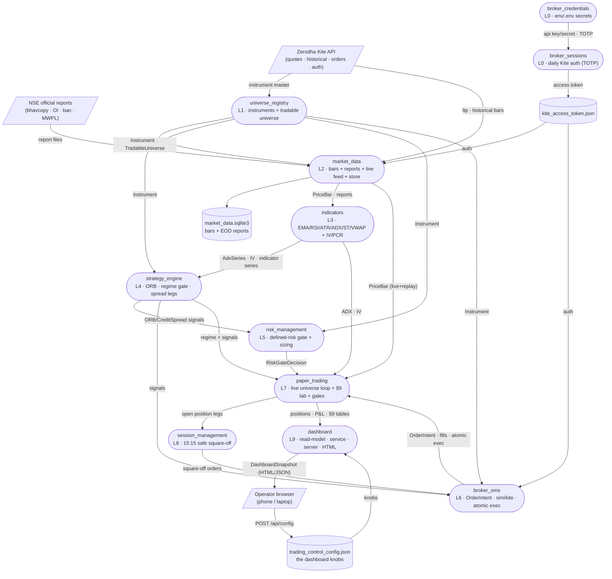
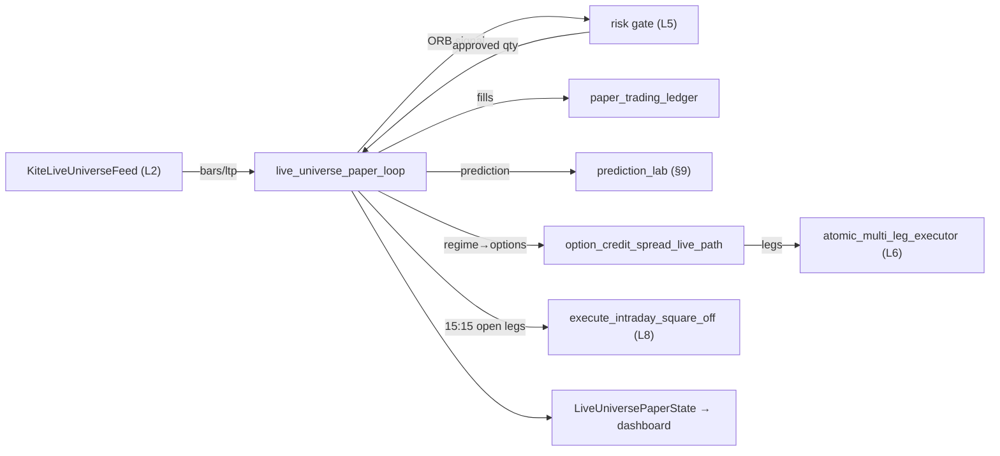
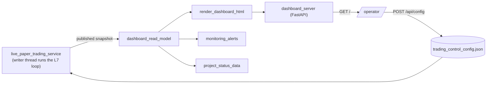

# SYSTEM MAP — the living architecture & data-flow map

**This is the single source of truth for how this project is built and how
data flows through it.** Read THIS first — before opening any source file.
A fresh agent (on any server) should be able to understand the whole system
from this one document, and any human/agent should be able to find "which
files make up feature X, what flows into it, what it emits, and how data
moves file-to-file inside it" without grepping the tree.

- **Format:** a Data-Flow Diagram (features = processes) fused with the C4
  model's Component→Code levels. Rendered in **Mermaid** (text = git-diffable,
  agent-parseable, renders in any Markdown/Artifact viewer).
- **Generated from the real code** (AST import graph), not memory — so it is
  true to what is actually on the server. Last regenerated: **2026-07-24**.
- **89 Python modules across 12 features** (packages under
  `src/nse_algo_trader/`).

---

## §0 · HOW TO READ AND MAINTAIN THIS MAP  (read before editing)

### How to read
- A **feature** = one package under `src/nse_algo_trader/` (≈ one layer).
  It is a box/subgraph. Inside it are its **files** (the "code" level).
- An **edge A → B labelled `X`** means *data `X` flows from A into B* (in
  code: B imports/calls A and consumes its output). Direction = data flow,
  NOT import direction (import is the reverse arrow).
- **Shapes:** `([rounded])` = a feature/process · `[(cylinder)]` = a data
  store (file/DB on disk) · `[/parallelogram/]` = an external entity
  (Kite API, NSE website, the browser operator).
- **Layer number** in each feature = its position in the build pipeline
  (see `docs/flowcharts/00_project_overview.md` for the roadmap).

### How to MAINTAIN (do this on EVERY new file or feature — Rule H)
When you add/rename/delete a file or feature, or change what flows between
them, you MUST update this map in the same change:
1. **Regenerate the ground truth** — run the extractor (below) to get the
   current file list, roles, and the real import/data-flow edges. Never
   hand-guess the graph; derive it from the code.
2. **Update §1** (system diagram) if a feature-to-feature edge appeared or
   vanished. Update §2 (the feature's registry block: files table + inputs/
   outputs + internal-flow diagram). Update §3 if a runtime loop changed.
3. **Append to §4** (maintenance ledger): date, what changed, why.
4. Keep every file's one-line role in sync with its module docstring (Rule C
   names + docstrings are the source of the role text).

### The extractor (run to regenerate ground truth)
```bash
python3 - <<'PY'
import ast; from pathlib import Path; from collections import defaultdict
SRC=Path("src/nse_algo_trader")
def feat(p): r=p.relative_to(SRC).parts; return r[0] if len(r)>1 else "(top)"
def doc(t): d=ast.get_docstring(t); return (d.splitlines()[0].strip() if d else "")
edges=defaultdict(set); files=defaultdict(list)
for m in sorted(SRC.rglob("*.py")):
    f=feat(m); files[f].append(m.stem)
    if m.name=="__init__.py": continue
    for n in ast.walk(ast.parse(m.read_text())):
        if isinstance(n,ast.ImportFrom) and n.module and n.module.startswith("nse_algo_trader"):
            tf=n.module.split(".")[1]
            if tf!=f: edges[f].add(tf)   # f imports tf  => data tf -> f
for f in sorted(edges): print(f, "<-", sorted(edges[f]))
PY
```
Edge reading: `A <- [B, C]` printed by the extractor means **A imports B and
C**, i.e. **data flows B→A and C→A**. §1 draws it in data-flow direction.

---

## §1 · SYSTEM DATA-FLOW (all features + external entities + stores)

Verified feature edges (2026-07-24): market_data←universe · indicators←market_data
· strategy_engine←{indicators,market_data,universe} · risk_management←{strategy,universe}
· broker_oms←{strategy,universe} · paper_trading←{broker_oms,indicators,market_data,
risk_management,session_management,strategy_engine,universe} · session_management←
{broker_oms,paper_trading,universe} · dashboard←(everything) · broker_sessions←
broker_credentials.



**The spine (build/data order):** `Kite/NSE → universe_registry → market_data
→ indicators → strategy_engine → risk_management → broker_oms →
paper_trading → session_management → dashboard → operator`. `broker_credentials
→ broker_sessions` is the side auth chain feeding Kite access to market_data,
broker_oms, and the dashboard. **`paper_trading` is the integration hub** (it
imports 7 features); **`dashboard` is the top observer** (it reads all).

---

## §2 · FEATURE REGISTRY (files · inputs · outputs · internal flow)

Each block: purpose · files (role) · what flows IN/OUT · internal file→file flow.

### L0 · broker_credentials  (2 files)  — secrets in, never committed
- `broker_api_credentials_loader.py` — loads API key/secret from env/.env; `load_broker_api_credentials`, `load_env_file_into_environ`.
- `kite_login_credentials_loader.py` — loads Kite user/password/TOTP secret; `load_kite_login_credentials`.
- IN: `.env` (gitignored). OUT: credentials → broker_sessions.
- Internal: `kite_login_credentials_loader → broker_api_credentials_loader`.

### L0 · broker_sessions  (3 files)  — daily Kite auth
- `kite_access_token_store.py` — persists the daily token + expiry; `KiteAccessTokenFileStore`.
- `kite_totp_auto_login.py` — user+password+TOTP → request token → access token; `generate_and_store_daily_kite_access_token`.
- `refresh_kite_access_token.py` — CLI (cron pre-market) that refreshes if stale; `refresh_kite_access_token_if_needed`.
- IN: credentials (L0). OUT: `kite_access_token.json` consumed by market_data/broker_oms/dashboard.
- Internal: `refresh → {totp_auto_login → access_token_store}`.

### L1 · universe_registry  (4 files)  — what is tradable
- `instrument_types.py` — `Instrument`, `ExchangeSegment`, `InstrumentKind`, `OptionRight` (the core type everything shares).
- `kite_instrument_master_loader.py` — classify Kite master rows → phase-1 universe; `build_phase1_instrument_universe`.
- `nse_index_options_reference.py` — the 5 NSE index-option underlyings.
- `live_tradable_universe.py` — mainboard cash + near-expiry ATM/ITM/OTM option ladders + index-spot resolver; `fetch_live_tradable_universe`, `TradableUniverse`, `resolve_spot_instrument_by_option_underlying`.
- IN: Kite instrument master + live spots. OUT: `Instrument` / `TradableUniverse` → market_data, strategy, risk, oms, paper_trading.

### L2 · market_data  (14 files)  — bars, reports, live feed, store
- `market_data_types.py` — `PriceBar`, `BarInterval`, `MarketTick`.
- `broker_data_source_protocols.py` — `HistoricalBarSource` / `LiveTickStreamSource` protocols.
- `kite_historical_bar_source.py` — Kite candles → `PriceBar`.
- `kite_live_tick_stream_source.py` — KiteTicker adapter (orphaned; superseded by the polling feed).
- `kite_live_universe_feed.py` — **the live-session feed**: batched-LTP breadth + `recent_intraday_bars` depth; `KiteLiveUniverseFeed`.
- `market_data_sqlite_store.py` — persists/loads bars + all 5 report types; `MarketDataSqliteStore`.
- `daily_nse_reports_ingestion_job.py`, `fo_bhavcopy_backfill_job.py` — ingestion jobs.
- `nse_official_reports/*` (6) — downloader + 5 parsers (cash bhavcopy/delivery, F&O OI, ban list, MWPL, bulk/block deals).
- IN: Kite (ltp/historical), NSE report files, `Instrument`. OUT: `PriceBar` (live + replay) → indicators/paper_trading; report rows → indicators/risk; the SQLite store.

### L3 · indicators  (10 files)  — features off bars/options
- Price-series: `exponential_moving_average`, `relative_strength_index`, `average_true_range`, `average_directional_index` (uses ATR), `supertrend_indicator` (uses ATR), `session_anchored_vwap`.
- Options-derived: `black_scholes_implied_volatility` (price/delta/IV-inversion), `end_of_day_atm_implied_volatility` (uses BS), `implied_volatility_rank`, `put_call_ratio`.
- IN: `PriceBar` (price series) + F&O bhavcopy rows (options). OUT: `AdxSeries`, IV, indicator series → strategy_engine + paper_trading (ADX warmup, ATM-IV).
- Internal: `average_directional_index → average_true_range`; `supertrend → average_true_range`; `end_of_day_atm_iv → black_scholes_iv`.

### L4 · strategy_engine  (5 files)  — signals (never orders)
- `strategy_signal_types.py` — `OpeningRangeBreakoutSignal`, `CreditSpreadSignal`, `SignalDirection`, `CreditSpreadBias`.
- `opening_range_breakout_strategy.py` — `detect_opening_range_breakout`.
- `session_strategy_regime_gate.py` — `classify_adx_market_regime`, `choose_v1_session_strategy` (ORB vs credit-spread vs stand-aside).
- `credit_spread_leg_selector.py` — `select_credit_spread_legs` (uses IV + delta).
- `option_moneyness_classifier.py` — ATM/ITM/OTM.
- IN: indicator series + `Instrument`. OUT: signals + regime choice → risk_management, broker_oms, paper_trading.

### L5 · risk_management  (4 files)  — the defined-risk gate
- `strategy_signal_types` consumers: `pre_trade_risk_gate.py` — `evaluate_opening_range_breakout_signal`, `evaluate_credit_spread_signal` (the gate every signal passes or dies at).
- `option_combination_risk_profile.py` — undefined-risk/naked detection; `assess_option_combination_risk`.
- `margin_requirement_estimator.py` — conservative margins.
- `risk_based_position_sizer.py` — `RiskBudgetConfig`, fixed-fractional sizing.
- IN: signals (L4) + `Instrument`. OUT: `RiskGateDecision` (approved qty | machine-readable reasons) → paper_trading.
- Internal: `pre_trade_risk_gate → {margin_requirement_estimator, option_combination_risk_profile, risk_based_position_sizer}`.

### L6 · broker_oms  (7 files)  — orders + execution parity
- `order_types.py` — `OrderIntent` (+ MARKET/LIMIT/**SL**/**SL-M**, product/validity/variety), `OrderExecutionResult`, lifecycle states.
- `broker_client_protocol.py` — `BrokerClient` (paper/live parity boundary).
- `simulated_broker_client.py` — paper fills + **SL/SL-M trigger emulation**.
- `kite_broker_client.py` — live Kite adapter (maps order types; MIS; SL-M-for-options → buffered SL-limit).
- `order_rate_limiter.py` — SEBI <10/s throttle.
- `signal_to_order_intents.py` — signals+approvals → `OrderIntent`s (ORB single; credit-spread hedge-first).
- `atomic_multi_leg_executor.py` — a spread is one unit or nothing (hedge BUY first, unwind on failure).
- IN: signals (L4), `RiskGateDecision` (L5), `Instrument`. OUT: `OrderIntent`s, fills, atomic exec → paper_trading + session_management.
- Internal: `atomic_multi_leg_executor → {broker_client_protocol, order_types}`; `signal_to_order_intents → order_types`; sim/kite clients → order_types.

### L7 · paper_trading  (18 files)  — the integration hub + live loop
- **Router/feed:** `nse_market_clock` (is-NSE-open authority) · `historical_bar_replay_source` · `market_clock_gated_data_source_router` (replay↔live) · `replay_universe_feed` (market-CLOSED universe feed).
- **Engines:** `opening_range_breakout_paper_engine` (replay ORB) · **`live_universe_paper_loop`** (the live cash loop: open/hold/manage/breakout-watch/L8 square-off) · **`option_credit_spread_live_path`** (options: regime-gated credit spreads + directional long options).
- **Ledger/fills:** `paper_trading_ledger` · `fill_slippage_model`.
- **§9 lab (`prediction_lab/`, 6):** `prediction_record` (immutable) · `adx_confidence_prediction` · `prediction_outcome_grading` (Brier) · `prediction_table_scoreboard` · `opening_range_breakout_prediction_lab`.
- **Promotion gates:** `strategy_promotion_gate` (Deflated-Sharpe) · `combinatorial_purged_cross_validation` (CPCV).
- IN: `PriceBar` (L2 live+replay), indicators (L3), signals+regime (L4), `RiskGateDecision` (L5), `OrderIntent`/broker (L6), square-off (L8). OUT: `LiveUniversePaperState` (open positions, closed trades, §9 scoreboard, spreads) → dashboard; open legs → session_management.
- Internal flow (live loop):


### L8 · session_management  (2 files)  — never carry overnight
- `intraday_square_off_schedule.py` — `IntradaySquareOffSchedule` (15:15 IST window; holiday/weekend aware).
- `intraday_square_off_executor.py` — `execute_intraday_square_off` (BUY-cover before SELL-hedge; retry-to-flat; unflattened surfaced CRITICAL); `OpenPositionLeg`.
- IN: open position legs (L7). OUT: safe square-off orders → broker_oms; `SquareOffReport` → the loop.

### L9 · dashboard  (8 files)  — observe (never trades)
- `trading_control_config.py` — the editable knobs (`TradingControlConfig`, load/save) — the config store.
- `config_enforced_paper_run.py` — maps config → risk budget + segment gates.
- `live_paper_trading_service.py` — **the always-on background service**: runs the live loop in a writer thread, publishes an immutable `LivePaperPublishedSnapshot` (open positions, segment boards, closed trades, §9 tables, strategy readiness).
- `dashboard_read_model.py` — assembles `DashboardSnapshot` (+ `OpenPositionSummary`, `SegmentBoard`, `StrategyReadinessSummary`).
- `monitoring_alerts.py` — time-gated alerts (open intraday=INFO, after-15:15=CRITICAL).
- `project_status_data.py` — layer roadmap + 16-trunk concept tree (static).
- `render_dashboard_html.py` — snapshot → standalone interactive HTML (3 §9 tables, scrollable; segment boards; closed trades; 20s poll; a "🗺️ System Map" header link → `/map`).
- `render_system_map_html.py` — renders THIS map (`docs/SYSTEM_MAP.md`) as its own page at `/map` (marked + mermaid, client-side); `render_system_map_html`, `load_system_map_markdown`.
- `dashboard_server.py` — FastAPI (`/`, `/map`, `/api/snapshot`, `/api/config`, capability-token gated).
- IN: everything (reads L1–L8 via the service) + `trading_control_config.json`. OUT: HTML/JSON → operator browser; `POST /api/config` writes the config store.
- Internal flow:


---

## §3 · RUNTIME FLOWS (the dynamic view a static graph can't show)

**A. Live scan pass** (`run_live_universe_scan_pass`, every ~5s while open):
1. price open positions (batched LTP) → manage stop/target exits.
2. check watched names for a live breakout of their cached opening range.
3. if ≥15:15 → `square_off_all_open_positions` via Layer 8 (else seed a batch:
   fetch bars → ORB detect (L4) → risk gate (L5) → open held position, or
   cache the opening range to watch).
4. options pass: per underlying, ADX regime → credit spread (range-bound) or
   directional long option (trending); atomic open (L6); manage on premium.

**B. Market-open→closed** (PLAN §1.4): `NseMarketClock` gates the router;
open → `KiteLiveUniverseFeed`, closed → `replay_universe_feed`/replay source
(paper never stops). Live real-money orders (future) gate on `clock==open`.

**C. Dashboard publish/read:** the service's single writer thread mutates
`LiveUniversePaperState` and publishes an immutable snapshot under a lock;
FastAPI request threads read only the snapshot (no read/write race).

**D. Daily auth:** `refresh_kite_access_token` (cron, pre-market) → TOTP
login → `kite_access_token.json` → consumed by the feed + broker clients.

---

## §4 · MAINTENANCE LEDGER

- **2026-07-24b** — Added `dashboard/render_system_map_html.py`: this map is
  now browsable IN the dashboard at `/map` (linked from the main page header),
  rendering these Mermaid diagrams client-side.
- **2026-07-24** — Map created from the live AST import graph (89 modules,
  12 features). Captures the live universe paper loop (cash + options +
  directional), the §9 lab, promotion gates, the market-clock router +
  replay feed, order-types extension, and the dashboard service/read-model/
  render/server. Regenerate via the §0 extractor on every file/feature change.
